Parent: [Audits](README.md)

# `DL_OVERLAND` removal candidates — visual verification

The same candidate list as [`OverlandDataLayerRemoval-2026-09-22.md`](OverlandDataLayerRemoval-2026-09-22.md), with an editor capture of every actor so the verdict can be checked by eye instead of taken on trust. Click a thumbnail to open the full 2560 x 1392 image.

Actors here carry `DL_OVERLAND` **assigned on the actor itself** and no line of sight reaches them from outside. For each one the fix is the same and is safe to apply mechanically: remove `DL_OVERLAND` from the actor's own runtime data layers. Nothing else changes — the exterior layer these actors also hold (`DL_HW_EXT` or `DL_HM_EXT`) is inherited from the containing Level Instance and stays where it is.

Derived from [Pass 2](DataLayerOverlap-Overland-Pass2-2026-09-22.md). Machine-readable form: [`OverlandDataLayerRemoval-2026-09-22.csv`](OverlandDataLayerRemoval-2026-09-22.csv), one row per actor, keyed by `Guid` and `SoftPath`.

## Contents

- [How to read this](#how-to-read-this)
- [Summary](#summary)
- [How the captures were made](#how-the-captures-were-made)
  - [Why a capture can look like an open exterior view](#why-a-capture-can-look-like-an-open-exterior-view)
- [Confirmed — Hogwarts](#confirmed--hogwarts)
- [No geometry — Hogwarts](#no-geometry--hogwarts)
- [Provisional — Hogsmeade](#provisional--hogsmeade)
- [What is deliberately not here](#what-is-deliberately-not-here)

---

## How to read this

Every row carries a `Confidence` value, and they are not interchangeable. An automated pass should act on `Confirmed` only, and treat the other two as review queues.

| Confidence | Meaning | Safe to process automatically |
| --- | --- | --- |
| `Confirmed` | Openness measured at exactly 0% with the calibrated 1 470-ray test: not one ray from the actor reaches open space | Yes |
| `NoGeometry` | The actor has an empty bounding box, so there is nothing to render and nothing to occlude. Not visible from anywhere, but unmeasurable, and the empty mesh is its own defect | No — decide the empty actor first |
| `Provisional` | Flagged by the earlier 182-ray test, which corner sampling later showed to be over-inclusive | No — re-measure first |

`Openness` is the percentage of the 1 470 cast rays that reach open space; it is only populated for `Confirmed` rows, where it is always 0. `Metric` records which test produced the verdict.

## Summary

| Confidence | Scope | Actors | Captured |
| --- | --- | ---: | ---: |
| `Confirmed` | Hogwarts / `LI_EntranceHall_EXT` | 25 | 25 |
| `NoGeometry` | Hogwarts / `LI_EntranceHall_EXT` | 5 | 5 |
| `Provisional` | Hogsmeade / `LI_HM_Streets_EXT`, `LI_Hogsmeade_River` | 39 | 0 |
| **Total** | | **69** | **30** |

All 69 actors have `DL_OVERLAND` and nothing else in their own runtime data layers, so the removal empties that list rather than editing it.

## How the captures were made

Every capture is the whole Unreal editor window at native resolution, taken through Unreal MCP with `BMK_HW_EXT_EntranceHall` loaded so the Level Instance content is resident. Per actor:

- The Outliner search box is set to the actor label and applied, so the Outliner shows that actor alone with its **Data Layer** column — this is the part to read when checking that `DL_OVERLAND` really is on the actor.
- The actor is selected, then tinted orange through the agent overlay and marked with a labelled arrow, so it stays identifiable even when it is wedged between walls.
- The camera is placed **inside** the enclosing cavity: rays are cast outward from the actor's bounds to find the direction with the most free space, and the camera is put along it at a distance that keeps it short of the first wall. A camera outside would only ever photograph the enclosure, which is the whole point of these actors.
- The viewport is set to `Unlit`, because these spaces receive no light and a lit capture is unreadable.

The Outliner row and the viewport therefore carry different evidence: the row proves the layer assignment, the viewport shows the actor is walled in.

### Why a capture can look like an open exterior view

Read the captures knowing this, or the list will look wrong. Most of these actors are not standing in a room — they are buried in the thickness of a wall. `SM_HW_EH_DoorFrame_ColumnDecor_B_114` sits 23 uu under the outer surface of `SM_HW_EH_Entrance_Porch_A`. The camera is therefore inside the porch mesh, and that geometry is single-sided: seen from within, the enclosure disappears, the shot looks wide open, and the carved panels on screen are the inner face of the porch viewed from behind.

The verdict does not rest on that view. For `B_114`, 0 of the 1 470 rays cast outward from the actor escape, and all 1 470 hit the porch. Traced the other way, from 4 000 uu out and aimed at the actor, 0 of 600 directions reach it — with simple and with complex collision alike — and the blockers vary: the porch, the landscape, `SM_HW_EH_Roof_A`, `SM_HW_GST_Wall_A`, several columns. The result is therefore not an artefact of one coarse collision box. Seen from outside with the actor tinted bright orange, it simply does not appear:

<a href="images/OverlandDataLayerRemoval-2026-09-22/full/SM_HW_EH_DoorFrame_ColumnDecor_B_114_exterior.jpg">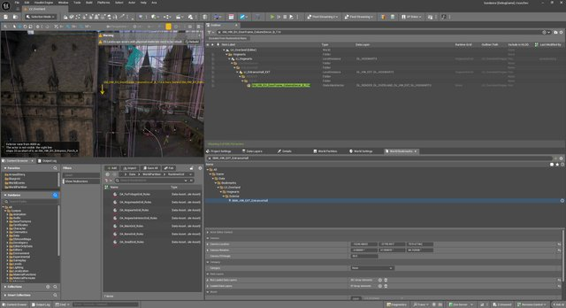</a>

The arrow marks where the actor is. Nothing orange shows through the facade.

## Confirmed — Hogwarts

25 actors inside `LI_EntranceHall_EXT`, every one measured at 0% openness. Remove `DL_OVERLAND` from each.

Eighteen of them are `SM_HW_EH_DoorFrame_ColumnDecor_B_*` stacked vertically over two ground positions, `(-10165, -29108)` and `(-10186, -29230)` — one walled-up or duplicated doorway rather than eighteen separate mistakes. The captures make this plain: consecutive rows show the same doorway from the same angle at rising heights. They are listed individually all the same, because the removal is per actor.

| # | Actor | Centre (x, y, z) | Exterior layer kept | GUID | Capture |
| ---: | --- | --- | --- | --- | --- |
| 1 | `SM_HW_EH_ColumnBase_Large_PartA5` | -10967.1, -28076.4, 7315.0 | `DL_HW_EXT` | `94735E5C-43BD-D50A-C12A-7B8099663C62` | <a href="images/OverlandDataLayerRemoval-2026-09-22/full/SM_HW_EH_ColumnBase_Large_PartA5.jpg">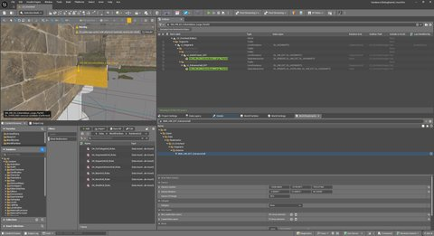</a> |
| 2 | `SM_HW_EH_ColumnBase_Large_PartB7` | -10967.3, -28076.3, 7365.9 | `DL_HW_EXT` | `282B0D61-4860-306D-CB31-9D976BFA93F1` | <a href="images/OverlandDataLayerRemoval-2026-09-22/full/SM_HW_EH_ColumnBase_Large_PartB7.jpg">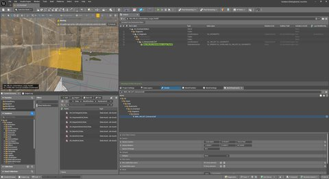</a> |
| 3 | `SM_HW_EH_ColumnBase_Large_PartC7` | -10967.3, -28076.3, 7406.5 | `DL_HW_EXT` | `B9146C3E-4371-F4C9-8C22-208F26820D5F` | <a href="images/OverlandDataLayerRemoval-2026-09-22/full/SM_HW_EH_ColumnBase_Large_PartC7.jpg">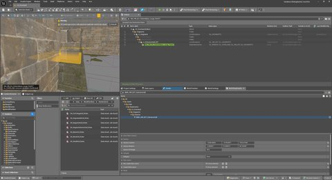</a> |
| 4 | `SM_HW_EH_DoorFrame_BaseColumn_A_12` | -10161.4, -29106.5, 7436.8 | `DL_HW_EXT` | `0EF40115-41C8-F934-925B-B3B54252169C` | <a href="images/OverlandDataLayerRemoval-2026-09-22/full/SM_HW_EH_DoorFrame_BaseColumn_A_12.jpg">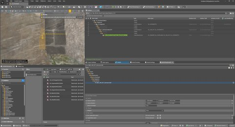</a> |
| 5 | `SM_HW_EH_DoorFrame_ColumnDecor_B_114` | -10186.3, -29229.8, 9348.4 | `DL_HW_EXT` | `69B0B91D-4E04-B026-D68F-089871B711BF` | <a href="images/OverlandDataLayerRemoval-2026-09-22/full/SM_HW_EH_DoorFrame_ColumnDecor_B_114.jpg">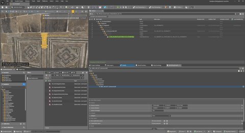</a> |
| 6 | `SM_HW_EH_DoorFrame_ColumnDecor_B_115` | -10165.1, -29107.9, 9348.4 | `DL_HW_EXT` | `9961E58B-460B-2C05-9275-CDA09092EF61` | <a href="images/OverlandDataLayerRemoval-2026-09-22/full/SM_HW_EH_DoorFrame_ColumnDecor_B_115.jpg">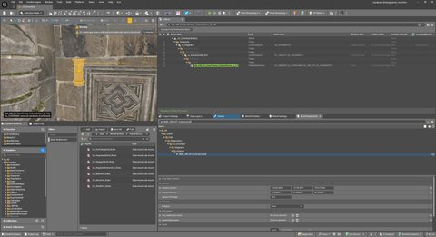</a> |
| 7 | `SM_HW_EH_DoorFrame_ColumnDecor_B_34` | -10186.3, -29229.8, 7784.2 | `DL_HW_EXT` | `8742E74A-4A59-429A-9019-398A06C2A517` | <a href="images/OverlandDataLayerRemoval-2026-09-22/full/SM_HW_EH_DoorFrame_ColumnDecor_B_34.jpg">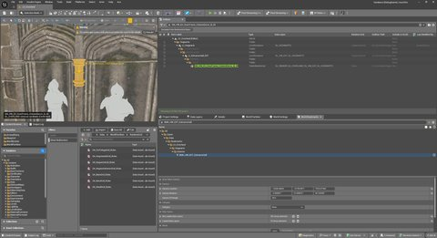</a> |
| 8 | `SM_HW_EH_DoorFrame_ColumnDecor_B_35` | -10165.1, -29107.9, 7784.2 | `DL_HW_EXT` | `74996D1E-40A1-6160-5DFD-D18CA0DB0908` | <a href="images/OverlandDataLayerRemoval-2026-09-22/full/SM_HW_EH_DoorFrame_ColumnDecor_B_35.jpg">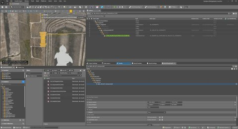</a> |
| 9 | `SM_HW_EH_DoorFrame_ColumnDecor_B_36` | -10165.1, -29107.9, 7964.4 | `DL_HW_EXT` | `89D949D4-408B-AD16-86E8-90B63D7C4F0A` | <a href="images/OverlandDataLayerRemoval-2026-09-22/full/SM_HW_EH_DoorFrame_ColumnDecor_B_36.jpg">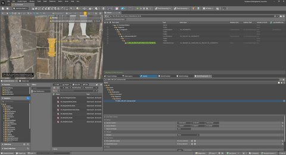</a> |
| 10 | `SM_HW_EH_DoorFrame_ColumnDecor_B_37` | -10186.3, -29229.8, 7964.4 | `DL_HW_EXT` | `ED40058D-47AD-B763-EE1F-6BB73C2D0A41` | <a href="images/OverlandDataLayerRemoval-2026-09-22/full/SM_HW_EH_DoorFrame_ColumnDecor_B_37.jpg">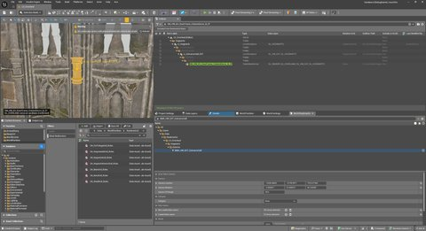</a> |
| 11 | `SM_HW_EH_DoorFrame_ColumnDecor_B_39` | -10165.1, -29107.9, 8150.1 | `DL_HW_EXT` | `4AC850B9-479D-B285-6ED0-298524C2778E` | <a href="images/OverlandDataLayerRemoval-2026-09-22/full/SM_HW_EH_DoorFrame_ColumnDecor_B_39.jpg">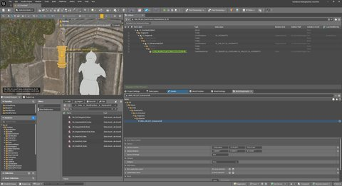</a> |
| 12 | `SM_HW_EH_DoorFrame_ColumnDecor_B_40` | -10186.3, -29229.8, 8150.1 | `DL_HW_EXT` | `AEDD4230-42E9-990B-CAE8-C3AE7F4AB98B` | <a href="images/OverlandDataLayerRemoval-2026-09-22/full/SM_HW_EH_DoorFrame_ColumnDecor_B_40.jpg">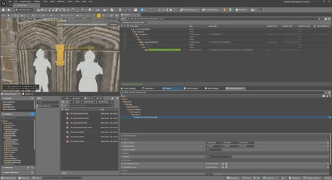</a> |
| 13 | `SM_HW_EH_DoorFrame_ColumnDecor_B_42` | -10165.1, -29107.9, 8396.2 | `DL_HW_EXT` | `559C09A6-47D8-28B7-1468-8D938CCA84FA` | <a href="images/OverlandDataLayerRemoval-2026-09-22/full/SM_HW_EH_DoorFrame_ColumnDecor_B_42.jpg">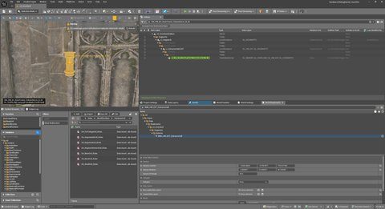</a> |
| 14 | `SM_HW_EH_DoorFrame_ColumnDecor_B_43` | -10186.3, -29229.8, 8396.2 | `DL_HW_EXT` | `50BD8383-4A4D-B238-48C0-CC956ADDA2DE` | <a href="images/OverlandDataLayerRemoval-2026-09-22/full/SM_HW_EH_DoorFrame_ColumnDecor_B_43.jpg">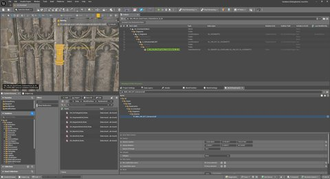</a> |
| 15 | `SM_HW_EH_DoorFrame_ColumnDecor_B_45` | -10165.1, -29107.9, 8602.7 | `DL_HW_EXT` | `A4D4B279-4334-5775-C34B-3E9B6B56F982` | <a href="images/OverlandDataLayerRemoval-2026-09-22/full/SM_HW_EH_DoorFrame_ColumnDecor_B_45.jpg">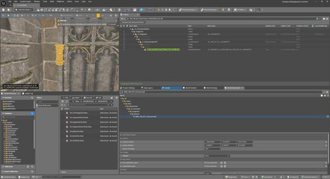</a> |
| 16 | `SM_HW_EH_DoorFrame_ColumnDecor_B_46` | -10186.3, -29229.8, 8602.7 | `DL_HW_EXT` | `E560E323-432D-9982-E0E6-85ACD7CD83F6` |  |
| 17 | `SM_HW_EH_DoorFrame_ColumnDecor_B_48` | -10165.1, -29107.9, 8803.3 | `DL_HW_EXT` | `8E424CA3-44B5-DCB3-D55B-4C9A941A6DE2` | <a href="images/OverlandDataLayerRemoval-2026-09-22/full/SM_HW_EH_DoorFrame_ColumnDecor_B_48.jpg">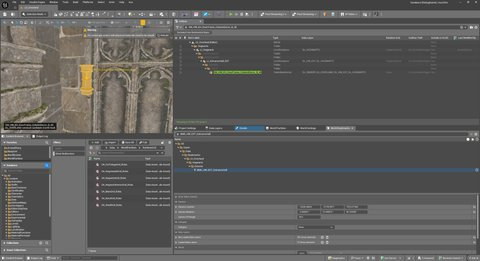</a> |
| 18 | `SM_HW_EH_DoorFrame_ColumnDecor_B_49` | -10186.3, -29229.8, 8803.3 | `DL_HW_EXT` | `E9A25181-4D13-E4E0-AB12-7FB23B9E7BD3` | <a href="images/OverlandDataLayerRemoval-2026-09-22/full/SM_HW_EH_DoorFrame_ColumnDecor_B_49.jpg">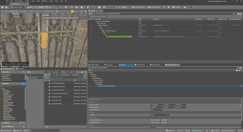</a> |
| 19 | `SM_HW_EH_DoorFrame_ColumnDecor_B_51` | -10165.1, -29107.9, 9001.3 | `DL_HW_EXT` | `89824C87-4629-C4E1-0CBA-7D87B9C47FFB` | <a href="images/OverlandDataLayerRemoval-2026-09-22/full/SM_HW_EH_DoorFrame_ColumnDecor_B_51.jpg">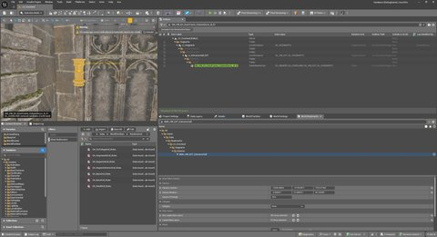</a> |
| 20 | `SM_HW_EH_DoorFrame_ColumnDecor_B_52` | -10186.3, -29229.8, 9001.3 | `DL_HW_EXT` | `FF1BECCB-4A73-AE2B-B981-A29E7332C0A6` | <a href="images/OverlandDataLayerRemoval-2026-09-22/full/SM_HW_EH_DoorFrame_ColumnDecor_B_52.jpg">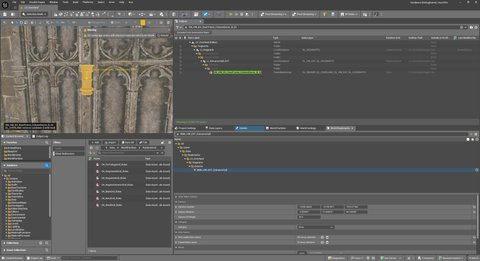</a> |
| 21 | `SM_HW_EH_DoorFrame_ColumnDecor_B_79` | -10186.3, -29229.8, 9223.0 | `DL_HW_EXT` | `8E1663D9-47E4-7683-3D5B-2DA14361020E` | <a href="images/OverlandDataLayerRemoval-2026-09-22/full/SM_HW_EH_DoorFrame_ColumnDecor_B_79.jpg">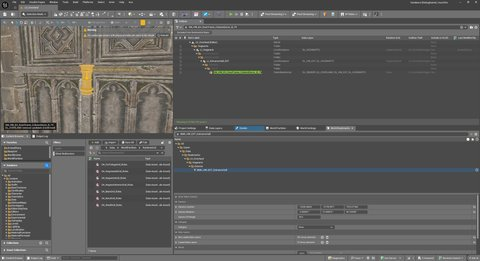</a> |
| 22 | `SM_HW_EH_DoorFrame_ColumnDecor_B_80` | -10165.1, -29107.9, 9223.0 | `DL_HW_EXT` | `2DBA7ED2-4577-F648-F8DB-E494462886C2` | <a href="images/OverlandDataLayerRemoval-2026-09-22/full/SM_HW_EH_DoorFrame_ColumnDecor_B_80.jpg">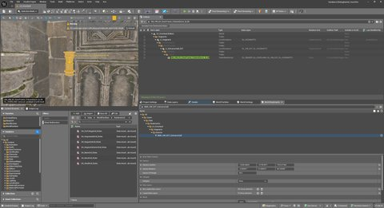</a> |
| 23 | `SM_HW_EH_JambKit_Column_Base_A7` | -8201.3, -26532.7, 9843.2 | `DL_HW_EXT` | `FBBF8DD5-4224-964A-F6F2-ABB5CD95F29B` | <a href="images/OverlandDataLayerRemoval-2026-09-22/full/SM_HW_EH_JambKit_Column_Base_A7.jpg">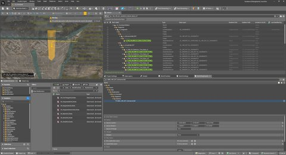</a> |
| 24 | `SM_HW_EH_JambKit_Column_Base_A8` | -8072.9, -25846.8, 9840.2 | `DL_HW_EXT` | `C9137E8B-4034-5158-3896-66AB55A88F88` | <a href="images/OverlandDataLayerRemoval-2026-09-22/full/SM_HW_EH_JambKit_Column_Base_A8.jpg">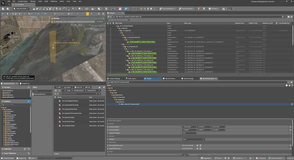</a> |
| 25 | `SM_HW_EH_Trim_Small_B47` | -10847.5, -27458.9, 7700.4 | `DL_HW_EXT` | `A3AF38BA-443F-ED3E-A2F4-73A1D1F8F767` | <a href="images/OverlandDataLayerRemoval-2026-09-22/full/SM_HW_EH_Trim_Small_B47.jpg">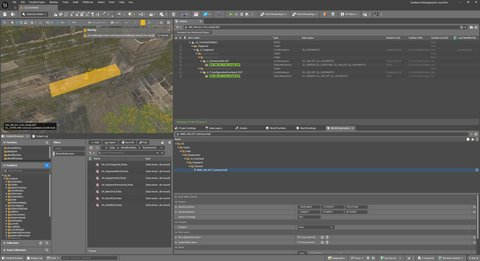</a> |

## No geometry — Hogwarts

5 actors whose bounding box is empty. They render nothing, so they cannot be visible from outside and the `DL_OVERLAND` removal is harmless — but an empty `StaticMeshActor` is a defect in its own right, and deleting the actor may be the better fix. Decide that before touching the layer.

Their captures show terrain or nearby geometry with the arrow pointing at an empty location, and no highlighted mesh anywhere. That is the expected result and is itself the evidence: there is nothing at the actor's position.

| # | Actor | Centre (x, y, z) | Exterior layer kept | GUID | Capture |
| ---: | --- | --- | --- | --- | --- |
| 1 | `SM_HW_EH_ColumnBase_Large_PartD` | -10514.9, -29829.7, 7300.0 | `DL_HW_EXT` | `94DBED3E-4996-86FB-30D1-9581E71A084F` | <a href="images/OverlandDataLayerRemoval-2026-09-22/full/SM_HW_EH_ColumnBase_Large_PartD.jpg">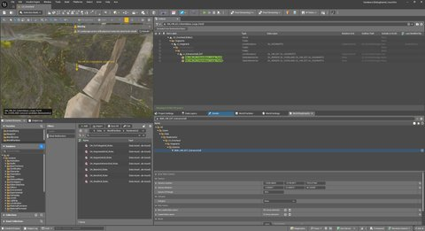</a> |
| 2 | `SM_HW_EH_ColumnBase_Large_PartD2` | -8446.1, -29326.4, 7300.0 | `DL_HW_EXT` | `36AD98FB-4206-B321-A63E-82A536C37C41` | <a href="images/OverlandDataLayerRemoval-2026-09-22/full/SM_HW_EH_ColumnBase_Large_PartD2.jpg">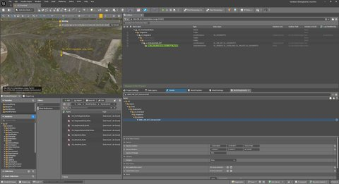</a> |
| 3 | `SM_HW_EH_ColumnBase_Large_PartE` | -9333.2, -30038.1, 7300.0 | `DL_HW_EXT` | `03F9B149-4D69-5882-39FD-2F8F7CE0F793` | <a href="images/OverlandDataLayerRemoval-2026-09-22/full/SM_HW_EH_ColumnBase_Large_PartE.jpg">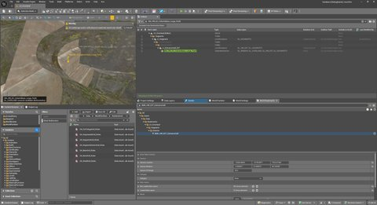</a> |
| 4 | `SM_HW_EH_ColumnBase_Large_PartF` | -10514.9, -29829.7, 7300.0 | `DL_HW_EXT` | `1BA1EE24-4FAA-E919-135E-D380DA345C23` | <a href="images/OverlandDataLayerRemoval-2026-09-22/full/SM_HW_EH_ColumnBase_Large_PartF.jpg">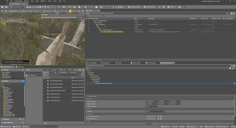</a> |
| 5 | `SM_HW_EH_ColumnBase_Large_PartG` | -9333.2, -30038.1, 7300.0 | `DL_HW_EXT` | `E92BBF85-4BF7-153B-F008-48B1933BFFC6` |  |

## Provisional — Hogsmeade

39 actors flagged by the 182-ray test. That test was later shown to be over-inclusive: of the 67 Entrance Hall actors it called sealed, only 25 survived the calibrated re-measurement, so roughly a third of this list is expected to hold. **Do not process these automatically.** They need the same 1 470-ray pass with `BMK_HOGSMEADE_EXTERIOR` loaded, which did not run because the editor hung during the reload.

They are uncaptured for the same reason: none of the 39 is resident in the editor while the Hogwarts bookmark is loaded, and the Hogsmeade reload is the step that previously hung. Capturing them means re-measuring them first — the two go together.

| # | Actor | Centre (x, y, z) | Exterior layer kept | GUID | Capture |
| ---: | --- | --- | --- | --- | --- |
| 1 | `SM_CobbleStreet_Block_A1072` | 9735.0, -69693.4, 3522.6 | `DL_HM_EXT` | `D26F2125-4E88-BBC9-CE5E-6EBABA41959C` | _not captured_ |
| 2 | `SM_CobbleStreet_Block_A1098` | 10226.9, -69403.5, 3503.9 | `DL_HM_EXT` | `C893D172-4D7B-E1DD-C4F9-0CBDB263DAA1` | _not captured_ |
| 3 | `SM_CobbleStreet_Block_A1100` | 10142.5, -69134.9, 3445.9 | `DL_HM_EXT` | `1E910F52-4F0D-883F-3F92-9099BF50D64D` | _not captured_ |
| 4 | `SM_CobbleStreet_Block_A1101` | 10090.2, -69005.3, 3417.3 | `DL_HM_EXT` | `6D001897-49F8-D472-3CFC-1785290518E5` | _not captured_ |
| 5 | `SM_CobbleStreet_Block_A1102` | 10035.6, -68873.8, 3386.8 | `DL_HM_EXT` | `A28142CB-4558-7E74-08F1-5FB8AC4D5D1C` | _not captured_ |
| 6 | `SM_CobbleStreet_Block_B1370` | 10152.1, -69160.7, 3452.6 | `DL_HM_EXT` | `F43EE567-4AFD-631C-57CE-60929F46C30F` | _not captured_ |
| 7 | `SM_CobbleStreet_Block_B1371` | 10101.4, -69031.3, 3421.6 | `DL_HM_EXT` | `7CD926B1-4EF7-849F-C1F1-B1A796662723` | _not captured_ |
| 8 | `SM_CobbleStreet_Block_B1372` | 10047.1, -68899.1, 3393.4 | `DL_HM_EXT` | `2D9B1C06-40AB-97BC-3FA2-66867E7CA24E` | _not captured_ |
| 9 | `SM_CobbleStreet_Block_C1178` | 10202.9, -69326.1, 3488.2 | `DL_HM_EXT` | `4628A93D-4CE2-05AA-8788-1B85BC693DCF` | _not captured_ |
| 10 | `SM_CobbleStreet_Block_C1179` | 10162.9, -69189.5, 3459.5 | `DL_HM_EXT` | `38B2A6A4-4432-86B8-0BD8-D8BFECAF1F07` | _not captured_ |
| 11 | `SM_CobbleStreet_Block_C1180` | 10111.7, -69060.5, 3429.5 | `DL_HM_EXT` | `A87A7F8C-43DA-9BED-2E8F-EABF2D437885` | _not captured_ |
| 12 | `SM_CobbleStreet_Block_C1181` | 10059.3, -68927.6, 3398.4 | `DL_HM_EXT` | `F45D0536-423E-06AE-B410-EDA8A7D07804` | _not captured_ |
| 13 | `SM_CobbleStreet_Block_D1869` | 10210.6, -69352.3, 3493.9 | `DL_HM_EXT` | `BCC42D21-4CA5-EEF7-F4DC-77972F068959` | _not captured_ |
| 14 | `SM_CobbleStreet_Block_D1870` | 10169.3, -69219.2, 3465.8 | `DL_HM_EXT` | `E09CCCEA-4FD9-D645-065D-27A565253722` | _not captured_ |
| 15 | `SM_CobbleStreet_Block_D1871` | 10121.6, -69086.0, 3435.7 | `DL_HM_EXT` | `DC877F32-4058-B1C6-455C-C99D43F3CC6B` | _not captured_ |
| 16 | `SM_CobbleStreet_Block_D1872` | 10069.7, -68954.1, 3404.7 | `DL_HM_EXT` | `0844FC3C-4A7A-9383-C2D1-91AEF6771AA5` | _not captured_ |
| 17 | `SM_CobbleStreet_Block_D1873` | 10013.7, -68825.1, 3378.4 | `DL_HM_EXT` | `D1E7596E-4E3C-14F7-E8E1-00A6EAFDA701` | _not captured_ |
| 18 | `SM_CobbleStreet_Block_E1212` | 9724.9, -69668.0, 3518.1 | `DL_HM_EXT` | `FC73E82F-4CD5-0881-D282-3FAD25C0671E` | _not captured_ |
| 19 | `SM_CobbleStreet_Block_E1237` | 10218.2, -69377.7, 3499.0 | `DL_HM_EXT` | `4AA165CD-4FDE-7612-CC53-9E9D54C43AFB` | _not captured_ |
| 20 | `SM_CobbleStreet_Block_E1238` | 10177.7, -69243.8, 3469.9 | `DL_HM_EXT` | `9C26A320-466B-A32D-6BAB-6F890DF7E0A2` | _not captured_ |
| 21 | `SM_CobbleStreet_Block_E1239` | 10132.8, -69109.9, 3440.7 | `DL_HM_EXT` | `C66F1D0F-4001-EB85-1946-E68E5C8D5F9D` | _not captured_ |
| 22 | `SM_CobbleStreet_Block_E1240` | 10080.7, -68978.6, 3410.4 | `DL_HM_EXT` | `948C0537-4B4E-904F-552E-6EBBA4798656` | _not captured_ |
| 23 | `SM_CobbleStreet_Block_E1241` | 10025.3, -68849.3, 3381.8 | `DL_HM_EXT` | `C43E3B15-4BD8-13C2-25ED-2DA72B58E539` | _not captured_ |
| 24 | `SM_HW_Apple_A24` | 5398.6, -87088.0, 5762.4 | `DL_HM_EXT` | `BAA8DDFC-4D67-76C7-53E4-E28959230C68` | _not captured_ |
| 25 | `SM_HW_Apple_A39` | 5357.2, -87036.5, 5759.7 | `DL_HM_EXT` | `2CE4EA91-4A17-5BC9-6AC4-2AB6CDF40AF1` | _not captured_ |
| 26 | `SM_HW_Apple_A41` | 5398.6, -87088.0, 5763.3 | `DL_HM_EXT` | `0D6E310D-4B7D-7273-E539-1ABB5CFDF13B` | _not captured_ |
| 27 | `SM_HW_Apple_A42` | 5391.3, -87084.9, 5761.6 | `DL_HM_EXT` | `D410FAD4-4D81-C46E-AF6C-7CAF1F6AC5A2` | _not captured_ |
| 28 | `SM_HW_Apple_A47` | 5411.2, -87079.0, 5762.9 | `DL_HM_EXT` | `72C13B38-4CE1-CECF-25FA-9789905D1849` | _not captured_ |
| 29 | `SM_HW_Apple_A49` | 5394.4, -87048.1, 5761.9 | `DL_HM_EXT` | `39375008-4B1A-611F-8B40-3B90E75EDB97` | _not captured_ |
| 30 | `SM_HW_Apple_C36` | 5401.4, -87070.4, 5761.7 | `DL_HM_EXT` | `8A050ECC-4F8B-5ABB-8FF0-A5855163E748` | _not captured_ |
| 31 | `SM_HW_Apple_C37` | 5382.6, -87070.7, 5761.4 | `DL_HM_EXT` | `3A2BDE30-47DC-46B3-B16A-8387A8A352AC` | _not captured_ |
| 32 | `SM_HW_Apple_C38` | 5394.3, -87076.7, 5761.5 | `DL_HM_EXT` | `3BA97861-49B3-7778-7C0D-EBB0782C935C` | _not captured_ |
| 33 | `SM_HW_Apple_C39` | 5378.5, -87080.8, 5761.6 | `DL_HM_EXT` | `42E77F61-46AC-7AA4-C790-38955A27B8CE` | _not captured_ |
| 34 | `SM_HW_Apple_C40` | 5370.7, -87036.2, 5761.8 | `DL_HM_EXT` | `2FEDA2D6-4C56-FA55-282F-D6A23729DE39` | _not captured_ |
| 35 | `SM_HW_Apple_C41` | 5381.9, -87043.1, 5761.9 | `DL_HM_EXT` | `5F4BC895-430A-9E99-8050-BF848ACA9758` | _not captured_ |
| 36 | `SM_HW_Apple_C43` | 5386.8, -87033.3, 5761.7 | `DL_HM_EXT` | `4DB13BF3-4B83-319A-4EEA-3BB3CCC95E94` | _not captured_ |
| 37 | `SM_OL_RockPile_A16` | 7843.6, -75346.8, 3955.4 | `DL_HM_EXT` | `7333264C-43D9-72DA-E0DF-758CB48AFB17` | _not captured_ |
| 38 | `SM_OL_RockPile_A17` | 7725.2, -75360.0, 3973.9 | `DL_HM_EXT` | `D18CD39E-4212-EA8E-86F2-BE9DBC052847` | _not captured_ |
| 39 | `SM_OL_RockPile_A18` | 7701.5, -75438.9, 3974.4 | `DL_HM_EXT` | `E1BAC99A-4308-A04E-E162-3A98D9A98507` | _not captured_ |

## What is deliberately not here

- **The reversed carrier.** Pass 1 found exactly one actor holding `DL_HW_EXT` on itself and inheriting `DL_OVERLAND` from `LI_QuidditchPitch`. There is no hand-placed `DL_OVERLAND` to remove from it, so it needs a different fix and has no row here.
- **Pure inheritors.** The 3 853 actors that carry neither layer themselves and inherit both cannot be fixed actor by actor; the correction belongs on the Level Instance above them.
- **Actors that are visible from outside.** Holding `DL_OVERLAND` together with an exterior layer is correct for anything actually seen from the Overland, which is most of the 2 865 carriers. Only the enclosed ones are listed.
- **`LI_Hogsmeade_River` beyond the bookmark.** Only 26 of its 705 carriers were resident when the test ran, so the river is essentially unexamined.
