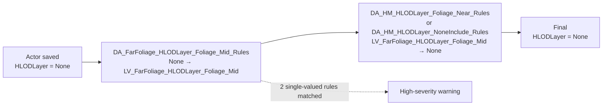

Parent: [Validate World Partition Rules — LV_Overland, 2026-09-27](README.md)

# Audit — `Multiple HLODLayer rule matches` warnings (LV_Overland)

| | |
| --- | --- |
| **Audit date** | October 1, 2026 |
| **Source report** | `report.txt` generated by WPRulesReviewer (`Sundance_Validate_27September_validate-LV_Overland.log`) |
| **Log date** | September 27, 2026 8:44 AM |
| **World** | `LV_Overland` |
| **Warning family** | `WarningKind.MultipleHLODLayerRules` — triaged as *"Multiple single-valued rules match one actor (only one should)"* |
| **Occurrences** | **463** (all `High` severity) |
| **Status** | Proposal — awaiting owner sign-off |

## Contents

- [1. Executive summary](#1-executive-summary)
- [2. Scope and method](#2-scope-and-method)
- [3. Findings](#3-findings)
  - [3.1 The whole family reduces to two rule pairs](#31-the-whole-family-reduces-to-two-rule-pairs)
  - [3.2 Every affected actor is inside the Hogsmeade level instance](#32-every-affected-actor-is-inside-the-hogsmeade-level-instance)
  - [3.3 Evaluation order makes the FarFoliage rule a no-op](#33-evaluation-order-makes-the-farfoliage-rule-a-no-op)
  - [3.4 Root cause](#34-root-cause)
  - [3.5 Secondary findings](#35-secondary-findings)
- [4. Proposal](#4-proposal)
  - [Option A — Exclude the Hogsmeade level instance from the FarFoliage rule (recommended)](#option-a--exclude-the-hogsmeade-level-instance-from-the-farfoliage-rule-recommended)
  - [Option B — Add Hogsmeade to the global HLOD ignore lists](#option-b--add-hogsmeade-to-the-global-hlod-ignore-lists)
  - [Option C — Narrow the FarFoliage rule to the river blockout only](#option-c--narrow-the-farfoliage-rule-to-the-river-blockout-only)
  - [Rejected options](#rejected-options)
- [5. Implementation plan](#5-implementation-plan)
- [6. Validation — expected deltas](#6-validation--expected-deltas)
- [7. Secondary track — reduce reviewer noise](#7-secondary-track--reduce-reviewer-noise)
- [8. Risk assessment](#8-risk-assessment)
- [Appendix A — Warning inventory](#appendix-a--warning-inventory)
- [Appendix B — All `HLODLayer` assignments in the log](#appendix-b--all-hlodlayer-assignments-in-the-log)
- [Appendix C — Reproduction commands](#appendix-c--reproduction-commands)

---

## 1. Executive summary

All 463 `Multiple HLODLayer rule matches` warnings in `LV_Overland` come from **one single
overlap**: `DA_FarFoliage_HLODLayer_Foliage_Mid_Rules` matches foliage actors that live **inside the
Hogsmeade level instance**, where the `DA_HM_HLODLayer_*_Rules` family is already authoritative.

Because `HLODLayer` is a single-valued assignment and the last matching rule wins,
`DA_FarFoliage_HLODLayer_Foliage_Mid_Rules` is evaluated first, sets
`LV_FarFoliage_HLODLayer_Foliage_Mid`, and is then **unconditionally overwritten back to `None`** by
the Hogsmeade rules. On all 463 actors the previous value before the FarFoliage rule was already
`None`, so the FarFoliage rule is a **pure no-op** on this population.

> **Recommended fix:** restrict `DA_FarFoliage_HLODLayer_Foliage_Mid_Rules` so it no longer matches
> actors under `LV_Overland/Hogsmeade/LI_Hogsmeade`. This removes **463/463 warnings (100%)** with
> **zero change to the final HLOD assignment of any actor**.

This is a single-asset, single-condition change. It is the highest value-per-effort item in the
anomaly backlog: 463 of the 1935 reported anomalies (**23.9%**), and the only `High`-severity
family besides asset import failures.

---

## 2. Scope and method

The audit is derived entirely from the markdown report produced by the reviewer
(`report.txt`, 101 993 lines). Every figure below is reproducible with the commands in
[Appendix C](#appendix-c--reproduction-commands).

Report-level context:

| Metric | Count |
| --- | ---: |
| Applied | 9 506 |
| Warnings | 92 452 |
| Errors | 0 |
| Anomalies (litigious) | 1 935 |
| Needs review | 90 529 |
| **This warning family** | **463** |

Warning families by volume (top 5):

| Count | Reason |
| ---: | --- |
| 87 923 | `Rule warning` (unclassified passthrough) |
| 2 264 | Runtime DataLayer `DL_OVERLAND` assigned but targeted by no rule |
| **463** | **Multiple single-valued rules match one actor (only one should)** |
| 323 | Runtime DataLayer `DL_HM_PIPPENS_POP` assigned but targeted by no rule |
| 12 | Runtime DataLayer `DL_AUTOMATION` assigned but targeted by no rule |

---

## 3. Findings

### 3.1 The whole family reduces to two rule pairs

Every one of the 463 warnings names exactly two rules, and
`DA_FarFoliage_HLODLayer_Foliage_Mid_Rules` is present in **100%** of them:

| Count | Share | Conflicting rules |
| ---: | ---: | --- |
| 279 | 60.3% | `DA_HM_HLODLayer_Foliage_Near_Rules` + `DA_FarFoliage_HLODLayer_Foliage_Mid_Rules` |
| 184 | 39.7% | `DA_HM_HLODLayer_NoneInclude_Rules` + `DA_FarFoliage_HLODLayer_Foliage_Mid_Rules` |

There is no three-way overlap, and no other `HLODLayer` rule pair conflicts anywhere in the world.
The 463 warnings cover 463 **distinct** actors (occurrence multiplier `x = 1` on every row).

### 3.2 Every affected actor is inside the Hogsmeade level instance

| Count | Parent outliner path |
| ---: | --- |
| 238 | `LV_Overland/Hogsmeade/LI_Hogsmeade/LI_Hogsmeade/Streets/LI_HM_StreetDressing_EXT` |
| 223 | `…/LI_HM_StreetDressing_EXT/HM_StreetDressing_General/HM_StreetDressing_Foliage` |
| 1 | `…/Streets/LI_HM_Streets_EXT/LI_TreeFountain` |
| 1 | `…/Buildings/LI_Building_L_EXT/Owlery_Basement` |

All 463 share the common prefix `LV_Overland/Hogsmeade/LI_Hogsmeade/LI_Hogsmeade/`. They are
vegetation assets only — 420 static meshes (`SM_*`) and 43 Nanite skeletal meshes (`SK_*`) — across
twelve species (Spruce 118, Larch 96, Alder 95, ScotsPine 38, Birch 31, Juniper 28, Gorse 27,
AshTree 13, Hawthorn 9, Ash 5, Oak 2, one misc. `HM_*`).

### 3.3 Evaluation order makes the FarFoliage rule a no-op

The report records both the assigned value and the previous value for each applied rule, which lets
us reconstruct the exact sequence:



Evidence, cross-checked on the 463 actors:

| Rule | Rows on the 463 actors | Value | Previous |
| --- | ---: | --- | --- |
| `DA_FarFoliage_HLODLayer_Foliage_Mid_Rules` | 463 | `LV_FarFoliage_HLODLayer_Foliage_Mid` | `None` (463/463) |
| `DA_HM_HLODLayer_Foliage_Near_Rules` | 279 | `None` | `LV_FarFoliage_HLODLayer_Foliage_Mid` |
| `DA_HM_HLODLayer_NoneInclude_Rules` | 184 | `None` | `LV_FarFoliage_HLODLayer_Foliage_Mid` |

Two consequences matter for the fix:

1. **The net result is already `None`.** Start value `None` → FarFoliage → `Foliage_Mid` → Hogsmeade
   rule → `None`. Removing the FarFoliage match changes nothing downstream.
2. **No `IncludeInHLOD` assignment touches these actors.** Zero `IncludeInHLOD` rows exist for any of
   the 463 actors, so the `None` HLOD layer is not paired with an inclusion flip that the FarFoliage
   rule could have been compensating for.

### 3.4 Root cause

`DA_FarFoliage_HLODLayer_Foliage_Mid_Rules` is a **world-wide foliage rule** whose conditions match
on asset/actor naming (vegetation prefixes) without excluding the areas that own their HLOD strategy.
Hogsmeade owns its own strategy through the `DA_HM_HLODLayer_*_Rules` family, which is registered
later in `HLODLayerRulesForActorSave` and therefore always wins.

The warning is thus **not** a symptom of an ambiguous intent — the intent is clear and the engine
resolves it correctly every time. It is a symptom of a **missing scope exclusion**. That is why the
family is uniform (one overlap, one shape, one outcome) rather than a long tail of special cases.

### 3.5 Secondary findings

These are not required to close the warnings, but they were surfaced by the same analysis and should
be tracked.

**(a) `DA_FarFoliage_HLODLayer_Foliage_Mid_Rules` is 91% dead weight.** It matches 508 actors in the
whole of `LV_Overland`:

| Count | Share | Location | Outcome |
| ---: | ---: | --- | --- |
| 463 | 91.1% | `LV_Overland/Hogsmeade/LI_Hogsmeade/…` | overwritten to `None` — wasted work + warning |
| 44 | 8.7% | `LV_Overland/Region/Hogwarts Valley/Hogsmeade_RiverBlockout/LI_Hogsmeade_River` | effective |
| 1 | 0.2% | `…/LI_Hogsmeade_River/Hogsmeade_RiverBlockout` | effective |

Only 45 actors actually end up on `LV_FarFoliage_HLODLayer_Foliage_Mid`, all inside the river
blockout level instance. A rule this narrow does not justify a world-wide condition set, and its
breadth is what creates the overlap. Note the near-identical names `LI_Hogsmeade` (must be excluded)
and `LI_Hogsmeade_River` (must be kept) — a prefix match on `Hogsmeade` would break the fix.

**(b) `DA_HM_HLODLayer_Foliage_Near_Rules` assigns `None`, not a "near" layer.** Across the entire
log this rule produces 279 `HLODLayer` assignments and **all 279 are `None`**. The name promises
`LV_Overland_HLODLayer_Near`-style behaviour and delivers exclusion from the HLOD layer instead.
Either the asset's target is wrong or the asset is misnamed; both are worth a reviewer pass, and this
ambiguity is a likely reason the overlap was never noticed.

**(c) The reviewer over-reports order-resolved overlaps.** `OracleEvaluator.ClassifyWarning` flags
every `MultipleHLODLayerRules` warning as `High` without comparing the matched rules against the
registration order in `HLODLayerRulesForActorSave`. See [§7](#7-secondary-track--reduce-reviewer-noise).

---

## 4. Proposal

### Option A — Exclude the Hogsmeade level instance from the FarFoliage rule *(recommended)*

Add an outliner-path exclusion to `DA_FarFoliage_HLODLayer_Foliage_Mid_Rules` so it stops matching
anything under `LV_Overland/Hogsmeade/LI_Hogsmeade`, keeping `LI_Hogsmeade_River` intact.

| | |
| --- | --- |
| **Warnings removed** | 463 / 463 (100%) |
| **Actors whose final HLODLayer changes** | 0 |
| **Assets to edit** | 1 (`DA_FarFoliage_HLODLayer_Foliage_Mid_Rules`) |
| **Risk** | Low — the excluded population is already forced to `None` by Hogsmeade rules |
| **Side benefit** | Removes 463 redundant actor mutations per validation pass |

Why it is the right shape: it encodes the authorship boundary that already exists in practice
("Hogsmeade owns Hogsmeade HLOD"), instead of relying on array order to silently undo a wrong match.
It is also future-proof — new foliage dropped into Hogsmeade will not regress the warning count.

### Option B — Add Hogsmeade to the global HLOD ignore lists

Use `[/Script/WorldBuildingEditor.WorldPartitionRuleSettings]` exclusion lists
(`OutlinerPathsToForceExcludeFromHLOD` or an equivalent per-type ignore list) to stop *all*
non-Hogsmeade HLOD rules at the `LI_Hogsmeade` boundary.

Stronger invariant and it would prevent any future rule from leaking in, but it is a **global**
change: it also short-circuits `DA_Overland_HLODLayer_*_Rules` for Hogsmeade actors, so it needs a
full-world diff before it can be trusted. Keep as a follow-up hardening step once Option A has
landed and the warning count is verified at zero.

### Option C — Narrow the FarFoliage rule to the river blockout only

Given finding (a) — only 45 actors benefit, all in `LI_Hogsmeade_River` — invert the condition and
scope the rule *positively* to that level instance. Cleanest end state and makes the rule's intent
self-documenting, but it asserts that the current 45-actor footprint is the intended one. That needs
confirmation from the FarFoliage owner, whereas Option A is provably behaviour-neutral today.

### Rejected options

| Option | Why rejected |
| --- | --- |
| Reorder `HLODLayerRulesForActorSave` so FarFoliage runs last | Inverts the winner: the 463 actors would move to `LV_FarFoliage_HLODLayer_Foliage_Mid`. Changes rendering, and the warning persists anyway (order does not suppress it). |
| Change the Hogsmeade rules | They already produce the desired final value. Editing the winner to work around the loser is backwards. |
| Suppress/downgrade the warning only | Hides a real redundancy and leaves 463 wasted mutations per pass. Acceptable only as the complement to a real fix (see §7). |

---

## 5. Implementation plan

1. **Locate and check out the asset.** Find the `DA_FarFoliage_HLODLayer_Foliage_Mid_Rules` package
   referenced from `+HLODLayerRulesForActorSave` in `DefaultEditor.ini`, and check it out in
   Perforce.
2. **Record the baseline.** Note the current condition set and the current match footprint
   (508 actors / 45 effective) in the changelist description, so the diff is reviewable.
3. **Add the exclusion.** Exclude the outliner path `LV_Overland/Hogsmeade/LI_Hogsmeade`. Use an
   exact level-instance scope, **not** a `Hogsmeade` substring match, so that
   `LV_Overland/Region/Hogwarts Valley/Hogsmeade_RiverBlockout/LI_Hogsmeade_River` keeps matching.
4. **Validate locally.** Re-run rules processing on `LV_Overland` and confirm the expected deltas in
   §6 before submitting.
5. **Submit and re-run the TeamCity validation build.** Open the resulting log in WPRulesReviewer and
   confirm the `Multiple HLODLayer rule matches` group is empty.
6. **Follow-ups.** File the two secondary findings: the `DA_HM_HLODLayer_Foliage_Near_Rules` naming /
   target mismatch (finding b), and the Option C narrowing of the FarFoliage rule.

---

## 6. Validation — expected deltas

Compare the next `LV_Overland` validation log against the September 27 baseline:

| Metric | Baseline (2026-09-27) | Expected after fix |
| --- | ---: | ---: |
| `Multiple HLODLayer rule matches` warnings | 463 | **0** |
| Anomalies (total) | 1 935 | 1 472 |
| `High` severity anomalies of this family | 463 | 0 |
| `DA_FarFoliage_HLODLayer_Foliage_Mid_Rules` applied rows | 508 | 45 |
| `DA_HM_HLODLayer_Foliage_Near_Rules` applied rows | 279 | 279 *(previous value becomes `None`)* |
| `DA_HM_HLODLayer_NoneInclude_Rules` `HLODLayer` rows | 275 | 275 |
| Actors with final `HLODLayer = LV_FarFoliage_HLODLayer_Foliage_Mid` | 45 | **45 (unchanged)** |
| Errors | 0 | 0 |

**Acceptance criteria**

- Zero warnings in the family.
- The 45 `LI_Hogsmeade_River` actors still receive `LV_FarFoliage_HLODLayer_Foliage_Mid`.
- No new anomaly family appears, and the `Applied` / `Errors` totals do not regress.
- Spot-check in the editor that Hogsmeade foliage HLOD is visually identical (expected, since the
  final value is unchanged).

**If the warning count does not drop to zero:** the residual rows identify actors whose outliner path
falls outside the excluded scope — most likely actors reparented out of `LI_Hogsmeade`. Re-run the
Appendix C grouping on the new report to get the exact paths.

---

## 7. Secondary track — reduce reviewer noise

Independent of the content fix, the reviewer itself can stop promoting order-resolved overlaps to
`High`. Today the classification ignores rule order — `Tools/WPRulesReviewer/src/WPRulesReviewer.Core/Oracle/OracleEvaluator.cs`:

```csharp
    private void ClassifyWarning(RuleRecord r)
    {
        switch (r.WarningKind)
        {
            case WarningKind.MultipleHLODLayerRules:
            case WarningKind.MultipleRuntimeGridRules:
                Set(r, ReviewStatus.Anomaly, AnomalySeverity.High,
                    "Multiple single-valued rules match one actor (only one should)");
                break;
```

`OracleConfig.HLODLayerRules` already preserves the registration order parsed from
`+HLODLayerRulesForActorSave`, but `OracleEvaluator` never reads it. Proposed refinement:

- **`High`** — the matched rules are *not* totally ordered in the registration array, or the final
  applied value does not match the last registered rule. Genuine ambiguity.
- **`Medium`** — the overlap is resolved deterministically by order *and* the final value equals the
  last-registered rule's target, but the overridden rule performed a real change. Redundant work
  worth cleaning.
- **`Low`** — the overridden rule's assignment was a round-trip back to the original value, i.e. a
  provable no-op. This is exactly the 463-row case here.

This would have surfaced the Hogsmeade overlap as a single `Low`-severity cluster of 463 identical
no-ops rather than 463 `High` anomalies, which is a much more accurate signal for the reviewer. It
also keeps the information visible instead of suppressing it.

---

## 8. Risk assessment

| Risk | Likelihood | Impact | Mitigation |
| --- | --- | --- | --- |
| Exclusion scope accidentally catches `LI_Hogsmeade_River` | Medium (names are near-identical) | 45 actors lose their HLOD layer | Use exact level-instance path, not a substring; §6 explicitly asserts the 45-actor count |
| Some Hogsmeade foliage relies on the FarFoliage layer in a code path not visible in the log | Low | HLOD visual regression | Report proves the final value is `None` for all 463 today; the fix cannot change it |
| Hogsmeade rules later stop matching some actors, leaving them with no HLOD layer | Low | Foliage drops out of HLOD | The Hogsmeade rules are unchanged by this fix; covered by the next validation run |
| Other worlds reference the FarFoliage rule | Low | Out-of-scope regression | Audit covers `LV_Overland` only — run the reviewer on other worlds before submitting |

**Rollback:** revert the single asset in Perforce. No `.ini`, no code, no data migration involved.

---

## Appendix A — Warning inventory

All 463 rows share `Sev = High`, `Type = Warning`, `Value` and `Previous` empty, `x = 1`.

| Conflicting rules | Parent folder | Count |
| --- | --- | ---: |
| `DA_HM_HLODLayer_Foliage_Near_Rules`, `DA_FarFoliage_HLODLayer_Foliage_Mid_Rules` | `HM_StreetDressing_Foliage` | 191 |
| `DA_HM_HLODLayer_NoneInclude_Rules`, `DA_FarFoliage_HLODLayer_Foliage_Mid_Rules` | `LI_HM_StreetDressing_EXT` | 150 |
| `DA_HM_HLODLayer_Foliage_Near_Rules`, `DA_FarFoliage_HLODLayer_Foliage_Mid_Rules` | `LI_HM_StreetDressing_EXT` | 88 |
| `DA_HM_HLODLayer_NoneInclude_Rules`, `DA_FarFoliage_HLODLayer_Foliage_Mid_Rules` | `HM_StreetDressing_Foliage` | 32 |
| `DA_HM_HLODLayer_NoneInclude_Rules`, `DA_FarFoliage_HLODLayer_Foliage_Mid_Rules` | `LI_TreeFountain` | 1 |
| `DA_HM_HLODLayer_NoneInclude_Rules`, `DA_FarFoliage_HLODLayer_Foliage_Mid_Rules` | `Owlery_Basement` | 1 |

The two singletons are the only actors outside the street-dressing hierarchy and are worth an
eyeball during validation:

- `LV_Overland/Hogsmeade/LI_Hogsmeade/LI_Hogsmeade/Streets/LI_HM_Streets_EXT/LI_TreeFountain/SK_HM_HeroBeech_A_Nanite`
- `LV_Overland/Hogsmeade/LI_Hogsmeade/LI_Hogsmeade/Buildings/LI_Building_L_EXT/Owlery_Basement/SM_Gorse_B`

## Appendix B — All `HLODLayer` assignments in the log

| Rule | Applied `HLODLayer` rows | Distinct values produced |
| --- | ---: | --- |
| `DA_FarFoliage_HLODLayer_Foliage_Mid_Rules` | 508 | `LV_FarFoliage_HLODLayer_Foliage_Mid` |
| `DA_HM_HLODLayer_Foliage_Near_Rules` | 279 | `None` *(see finding b)* |
| `DA_HM_HLODLayer_NoneInclude_Rules` | 275 | `None` |
| `DA_HM_HLODLayer_NoneExclude_Rules` | 6 | `None` |
| `DA_Overland_HLODLayer_NoneExclude_Rules` | 2 | `None` |
| `DA_Overland_HLODLayer_Near_Rules` | 2 | `LV_Overland_HLODLayer_Near` |
| *(forced)* | 2 | — |

`DA_HM_HLODLayer_NoneInclude_Rules` additionally produces 72 `IncludeInHLOD` assignments
(`false → true`), none of them on the 463 audited actors.

## Appendix C — Reproduction commands

Run from PowerShell against the source report. `$R` is the path to `report.txt`.

```powershell
$R = 'report.txt'
$lines = Get-Content $R

# The 463 warning rows
$warn = $lines |
  Where-Object { $_ -like '*Multiple single-valued rules match one actor*' } |
  ForEach-Object { $p = $_ -split '\|'; [pscustomobject]@{
      Rules = $p[5].Trim(); Actor = $p[6].Trim().Trim('`'); X = [int]$p[8].Trim() } }
$warn.Count                      # 463
($warn.X | Measure-Object -Sum)  # 463 -> one occurrence per actor

# Conflicting rule pairs
$warn | Group-Object Rules | Sort-Object Count -Descending |
  Format-Table Count, Name -AutoSize -Wrap

# Parent folder distribution
$warn | ForEach-Object { $s = $_.Actor -split '/'; $s[-2] } |
  Group-Object | Sort-Object Count -Descending | Format-Table Count, Name -AutoSize

# Applied rows for the three rules, with value / previous value
$lines |
  Where-Object { $_ -match '\| (DA_HM_HLODLayer_Foliage_Near_Rules|DA_HM_HLODLayer_NoneInclude_Rules|DA_FarFoliage_HLODLayer_Foliage_Mid_Rules) \|' } |
  ForEach-Object { $p = $_ -split '\|'; "$($p[5].Trim()) : $($p[3].Trim()) <- $($p[4].Trim())" } |
  Group-Object | Sort-Object Count -Descending | Format-Table Count, Name -AutoSize -Wrap

# FarFoliage match footprint outside the Hogsmeade level instance (the 45 effective actors)
$lines |
  Where-Object { $_ -match '\| DA_FarFoliage_HLODLayer_Foliage_Mid_Rules \|' -and $_ -notlike '*LV_Overland/Hogsmeade/*' } |
  ForEach-Object { $s = (($_ -split '\|')[6]).Trim().Trim('`') -split '/'; ($s[0..($s.Count - 2)] -join '/') } |
  Group-Object | Sort-Object Count -Descending | Format-Table Count, Name -AutoSize -Wrap
```
