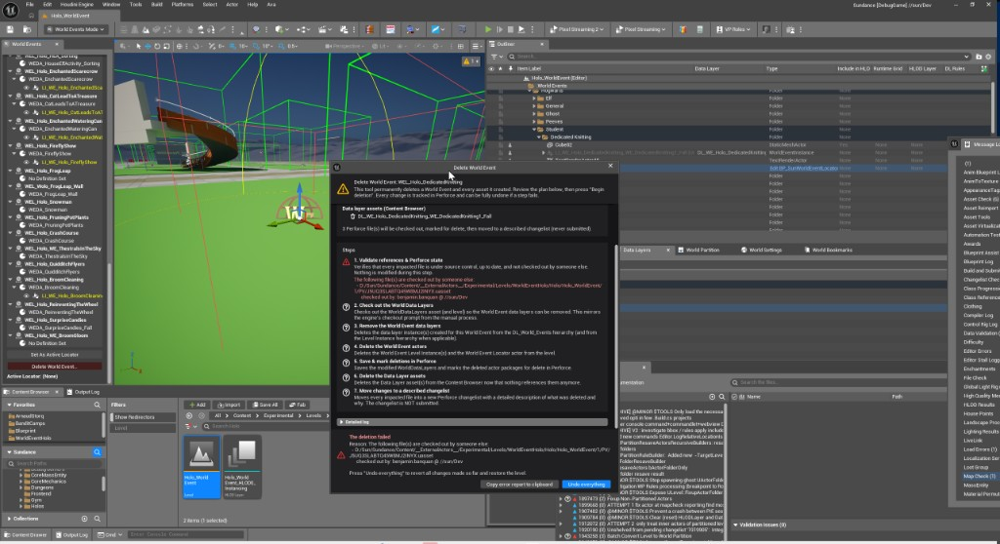

Parent: [Custom Tools](../CustomTools.md)

# Delete World Event (World Events Editor Mode)

An editor-mode UI tool: buttons and dialogs surfaced inside a dedicated editor mode.

**A one-click, guided dialog that deletes a World Event and every asset it created
(locator, level instance(s), data layer instance(s) and data layer asset(s)) from the
Overland — or just the World Events you pick on a multi-event Locator — with live per-step
progress and a full rollback on failure.**

Source: `D:\Sun\Sundance\Source\SundanceEditor\WorldEvents\EditorMode\Deletion\`
(`WorldEventDeleter.h/.cpp`, `SWorldEventDeleteDialog.h/.cpp`) · entry point in
`WorldEventEditorModeToolkit.cpp` · log category `LogWorldEventEditorMode`
(lines prefixed `[WE Delete]`). Jira: **SUNDANCE-40173** (the tool),
**SUNDANCE-77885** (selective deletion).

## Contents

- [Why it exists](#why-it-exists)
- [How to open it](#how-to-open-it)
- [The dialog](#the-dialog)
- [Selective deletion](#selective-deletion)
- [What it does (steps)](#what-it-does-steps)
- [Error handling & rollback](#error-handling--rollback)
- [Source control](#source-control)
- [Scope & notes](#scope--notes)
- [See also](#see-also)

## Why it exists

Deleting a World Event by hand is tedious and error-prone because placing one creates a
web of references: a `WorldEventLocator` actor, one `WorldEventInstance` (Level Instance)
per definition, a `DataLayerAsset` in the Content Browser, and the matching data layer
**instance(s)** registered in `WorldDataLayers` (and, when the event sits inside a Level
Instance such as Hogwarts/Hogsmeade, a second instance in that hierarchy). The manual
procedure — documented in confluence *"Deleting World Events from the Overland"* — is a
strict ordered sequence of deletions ending with 4–5 files in a changelist. Missing a
step leaves dangling references. This tool automates the whole procedure safely.

## How to open it

1. Enter the **World Events** editor mode.
2. In the **Manage** tab, select the target Locator (or one of its entries) in the tree.
3. Click the red **"Delete World Event..."** button. The guided dialog opens.

Nothing is modified until you press **Begin deletion**.

## The dialog

A polished, self-explanatory modal wizard:

- **Header** — warning icon, the World Event name, and a plain-language summary.
- **"Which World Events to delete"** — only shown when the Locator carries more than one
  World Event. See [Selective deletion](#selective-deletion) below.
- **"What will be deleted"** — a transparent, up-front inventory of every actor, data
  layer instance, data layer asset, and the number of Perforce files that will be touched.
  On a selective deletion it is followed by **"What will be preserved"**.
- **Steps** — the ordered list below; each row shows a live **spinner → green tick ✓ /
  red cross ✗** plus a status message.
- **Detailed log** — a collapsible, scrollable log of everything that happened.
- **Buttons** — `Begin deletion` (explicit confirmation), `Cancel`, and — only after a
  failure — `Undo everything`.

## Selective deletion

A Locator can list several possible World Events, and removing one of them — to swap an
event for another, for instance — used to mean deleting the Locator and rebuilding it.

When the Locator has more than one World Event, the dialog opens on a checkbox list: one
row per possible World Event, showing the Level Instance and data layer that row owns, plus
`All` / `None` shortcuts and a separate **"Also delete the Locator actor itself"**
checkbox. Everything below the list — the plan, the preserved list, the step list and the
changelist description — is rebuilt live from the selection, so what you confirm is exactly
what runs. The default selection is every World Event plus the Locator, which is the
whole-locator deletion described above.

Three rules make a partial deletion safe:

- **The Locator can only be deleted when every World Event is selected.** Uncheck one event
  and the Locator checkbox is disabled and forced off: a Locator whose remaining World
  Events are preserved has to be preserved with them.
- **A preserved Locator is modified, not deleted.** Its actor package is checked out and
  saved instead of being marked for delete, and its conditions, bounds, tags and remaining
  World Events are left untouched.
- **A data layer asset still referenced by a preserved World Event is kept**, along with
  its data layer instance(s), and listed under "What will be preserved". Deleting it would
  leave the surviving World Event pointing at a missing asset.

A selective deletion inserts one extra step, *"Remove the selected World Events from the
Locator"*, between the data layer removal and the actor deletion. The entries are taken out
of `PossibleWorldEvents` directly rather than through `PostEditChangeProperty`, because that
path destroys the orphaned Level Instances outside the plan — their packages would never be
marked for delete and their World Partition descriptors would linger as "(Unloaded)". The
step refuses to run if the array changed since the plan was built.

The changelist description reflects the scope: `Removed 1 of 3 World Event(s) from locator
'X'`, with the removed entries, the deleted assets, and what was preserved.

## What it does (steps)

The steps map onto the manual confluence procedure, with step 4 present only on a
selective deletion:

1. **Validate references & Perforce state** — every impacted file must be source
   controlled, up to date, and not checked out by someone else. Nothing is modified.
2. **Check out the World Data Layers** (and level), plus the Locator actor package when the
   Locator is preserved.
3. **Remove the World Event data layers** — deletes the data layer instance(s) from the
   `DL_World_Events` hierarchy (and the Level Instance hierarchy when applicable).
4. **Remove the selected World Events from the Locator** — *selective deletion only*: takes
   the selected entries out of `PossibleWorldEvents`.
5. **Delete the World Event actors** — the Level Instance(s) and, unless it is preserved,
   the Locator.
6. **Save & mark deletions in Perforce** — saves the modified `WorldDataLayers` (and the
   preserved Locator) and marks the deleted actor packages for delete.
7. **Delete the Data Layer assets** — from the Content Browser, now unreferenced.
8. **Move changes to a described changelist** — all impacted files are moved into a new
   Perforce changelist whose description lists exactly what was deleted and why.

## Error handling & rollback

The design is **atomic**: if any step fails, nothing is left half-done.

- All fallible preconditions are checked in step 1, **before** any change.
- On failure the dialog turns red, names the failing step and the reason, and offers a
  single **"Undo everything"** button.
- Rollback reverts **every** touched Perforce file (`USourceControlHelpers::RevertFiles`)
  and — if the in-editor world was already mutated — **reloads the level** so the editor
  returns exactly to its pre-deletion state.

## Source control

- Checkout is automatic and silent (`USourceControlHelpers::CheckOutOrAddFiles`).
- Success moves all files into a new **described** changelist (`FNewChangelist`).
- **Nothing is ever submitted automatically** — you review and submit the changelist
  yourself.

## Scope & notes

- Granularity is either the **whole Locator** (locator + everything it created) or a
  **subset of its World Events** — see [Selective deletion](#selective-deletion).
- The reusable `WorldEventDefinition` data asset is **not** deleted (it is shared).
- Failure to move files to the described changelist (step 7) is treated as a **non-fatal
  warning** — the deletion still succeeded and the files remain in the default changelist.

## See also

- [World Events (work-done narrative)](../../WorkDoneByTopic/WorldEvents.md) — the World Events system context
- [Perforce source control](../PerforceSourceControl.md) — checkout-before-save, changelists
- [Level Instances & OFPA](../LevelInstancesAndOFPA.md) — external actor packages & Level Instance editing

---

**In this section:** [Runtime Grid Reference Tools](RuntimeGridReferenceTools.md) | **Delete World Event** | [Exclude From Rules tag](ExcludeFromRulesTag.md) | [World Partition Batch Converter](WorldPartitionBatchConverter.md)

Back to [Custom Tools](../CustomTools.md).
