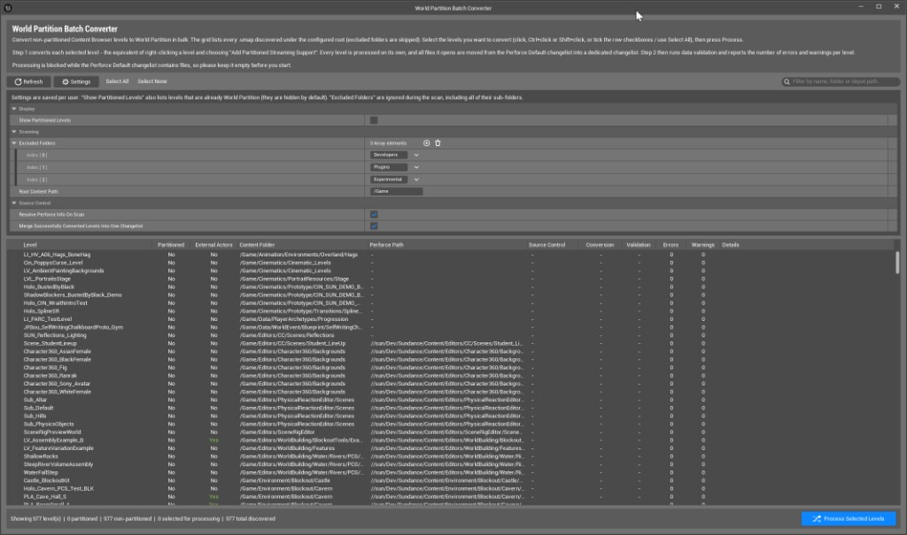

Parent: [Custom Tools](../CustomTools.md)

# World Partition Batch Converter

An editor-mode UI tool: a standalone Slate window opened from the main menu.

**A grid-driven dialog that batch-converts many non-partitioned Content Browser levels to
World Partition in one pass — the equivalent of running the right-click *"Add Partitioned
Streaming Support"* on each level — then runs data validation on the results and organises
every converted level's files into descriptive Perforce changelists.**

Source: `D:\Sun\Sundance\Plugins\EditorImprovements\Source\WEditorImprovements\...\WorldPartitionConverter\`
(`SWWorldPartitionConverterWindow.h/.cpp` — the Slate window; `WWorldPartitionConverterProcessor.h/.cpp`
— the UI-independent backend; `WWorldPartitionConverterSettings.h/.cpp` — persistent settings;
`WWorldPartitionConverterTypes.h` — the row model & enums;
`WWorldPartitionConverterSubModule.h/.cpp`
— menu & settings registration). Log category `LogWPBatchConverter`. Jira: **SUNDANCE-69603**.
Implemented in changelist **1972620**.

## Contents

- [Why it exists](#why-it-exists)
- [How to open it](#how-to-open-it)
- [The window](#the-window)
- [Settings](#settings)
- [What it does (per run)](#what-it-does-per-run)
- [Crash quarantine](#crash-quarantine)
- [Source control](#source-control)
  - [Reverting the tool's changelists](#reverting-the-tools-changelists)
- [Refreshing level instance owners](#refreshing-level-instance-owners)
- [Grouping per-level changelists](#grouping-per-level-changelists)
- [Threading & responsiveness](#threading--responsiveness)
- [Backend & commandlet reuse](#backend--commandlet-reuse)
- [See also](#see-also)

## Why it exists

Converting a level to World Partition by hand means opening it, running *"Add Partitioned
Streaming Support"*, saving, then hand-managing the resulting `.umap` and external actor
(OFPA) packages in Perforce — repeated once per level. Across a project with hundreds of
levels that is slow and error-prone. This tool discovers every candidate level, lets you
pick which ones to convert, and performs the conversion + save + source-control bookkeeping
+ post-conversion validation automatically, one level at a time, with a clear audit trail.

## How to open it

**Tools** menu → **World Partition** section → **"Convert Levels to World Partition
(Batch)..."** (placed immediately below the engine's stock *"Convert Level..."* entry). This
opens the **World Partition Batch Converter** window.

Nothing is modified until you select levels and press **Process Selected Levels**.

## The window

- **Header** — title and a short plain-language explanation of what the tool does.
- **Toolbar** — `Refresh` (re-scan), `Settings` (toggles the inline settings panel),
  `Select All` / `Select None`, a **Clear Crashed Conversions** button (enabled only when at
  least one level is flagged as crashed — see *Crash quarantine* below), a **Hide
  non-convertible levels** checkbox (off by default — when on, levels whose files are locked or
  not at the head revision are hidden from the grid), and a search box that filters by level
  name, folder or depot path.
- **Grid** — one row per discovered `.umap`, with columns:
  | Column | Meaning |
  |--------|---------|
  | *(checkbox)* | Selection for processing (kept in sync with the row highlight). |
  | **Level** | Short level name. Nested under an expander when it is instanced by another level (the dependency tree). |
  | **Cascade** | How many levels a conversion started here would convert in total (this level plus its non-partitioned descendants). A trailing `*` marks a **shared** level (instanced by more than one parent), whose conversion also affects the other branches that reuse it. `...` while the tree is still building, `-` for already-partitioned levels. |
  | **Partitioned** | Whether the level already uses World Partition (read from asset registry tags — no package load). |
  | **External Actors** | Whether actors are already stored in external (OFPA) packages. |
  | **Content Folder** | The `/Game/...` folder the level lives in. |
  | **Perforce Path** | Depot path, resolved via source control. |
  | **Source Control** | Human-readable status (checked out, up to date, not in depot, locked by <user>, ...). |
  | **Convertible** | Predicts whether the level can be converted **right now**: green **Yes**, or red **No** when any file it would need to check out is locked by another user or is not at the head revision (hover for the reason). The check is **hierarchical**: it covers the whole **conversion closure** — the `.umap`, the level's own external actor / object (OFPA) packages, **every non-partitioned level it instances (transitively) plus their external packages**, and the **packages of the worlds that instance the closure** (all resaved by the cascade). A single locked or out-of-date file *anywhere in that subtree* marks the level non-convertible. `-` until source control is resolved, or for already-partitioned levels. |
  | **Conversion** | `-` / green **Converted** / red **Failed** / red **Failed Validation** / red **Crashed** (hover for the reason). **Failed Validation** means the level converted but failed data validation, so its changelist was automatically reverted (see *What it does* step 4). **Crashed** means a previous conversion of this level brought the editor down; it stays blocked from processing until you press **Clear Crashed Conversions** (see *Crash quarantine* below). |
  | **Validation** | Tri-state icon: green tick ✓ / amber warning / red error. |
  | **Errors** / **Warnings** | Validation counts. |
  | **Details** | The last operation's message (also surfaced as tooltips). |
- **Operation Log** — a scrollable, read-only text log of the major operations performed
  during processing (with timestamps); a `Clear` button hides it. Appears only once there
  is something to show.
- **Status bar** — counts of shown / partitioned / non-partitioned / selected / total
  levels, plus the **Process Selected Levels** button.
- **Bottom bar** — a red **Revert Tool Changelists...** button that opens the revert dialog
  (see below) to completely undo conversions this tool performed, and a
  **Group Converted Level Changelists...** button that opens a picker dialog to consolidate the
  chosen per-level changelists into batched changelists on demand
  (see *Grouping per-level changelists* below).

By default the grid lists **only non-partitioned levels** (the conversion candidates).
Right-clicking a row offers **Show in Content Browser** and **Copy Package Path**.

## Settings

Persistent per-user settings (stored in `EditorPerProjectUserSettings`; also reachable via
**Editor Preferences → Plugins → World Partition Batch Converter**):

| Setting | Default | Effect |
|---------|---------|--------|
| **Show Partitioned Levels** | off | When on, the grid also lists levels that are already World Partition. |
| **Excluded Folders** | `Developers`, `Plugins`, `Experimental` | Folders under `/Game` skipped while scanning (sub-folders too). |
| **Root Content Path** | `/Game` | Root virtual path the scan starts from. |
| **Resolve Perforce Info On Scan** | on | Query source control during the scan to fill the depot path / status columns (disable for a faster scan). |
| **Levels Per Changelist** | 50 | Max number of levels put into each grouped changelist by the **Group Converted Level Changelists...** action (editable). |
| **Shelve When Grouping** | off | When on, each grouped changelist is shelved after creation (ready for preflight/review). Off by default: grouping only reorganises the pending changelists locally. |

## What it does (per run)

1. **Pre-flight** — processing is refused if the Perforce **Default** changelist already
   contains files, so each converted level can be isolated in its own changelist. A message
   explains the problem.
2. **Cascade expansion** — the selection is expanded to its full **downward closure**: each
   selected level plus every non-partitioned level it instances, transitively. The closure is
   then ordered **leaf-to-root** (a child always converts before the parents that instance it),
   so the whole hierarchy becomes nested World Partition together rather than leaving a
   partitioned parent pointing at a non-partitioned child. The confirmation dialog reports how
   many extra nested levels were pulled in.
3. **Per level** (each level of the ordered closure, one at a time):
   - Load the world as an inactive world and check its preconditions (not currently loaded
     in the editor, no sublevels).
   - **Cascade gate** — skip the level if any level it instances is still non-partitioned (a
     dependency that failed or sits outside the scanned set); converting it now would recreate
     the partitioned-parent / non-partitioned-child mismatch the cascade exists to prevent.
   - Convert with `FWorldPartitionConverter::Convert` using the same parameters as *"Add
     Partitioned Streaming Support"* (`bConvertSubLevels=false`, `bEnableStreaming=false`,
     `bUseActorFolders=true`).
   - Resave the packages that **instance** this level, so their cached level-instance
     descriptors match the new container (see *Refreshing level instance owners* below).
     Instancers that are **themselves part of this run** are left untouched here: they convert
     later (leaf-to-root order) and regenerate their descriptors against the already-converted
     child then, which also keeps every file in a single changelist.
   - Save only the affected packages (the map, its external object packages and those
     instancing packages), check them out / mark for add, and **move that level's files into a
     dedicated new changelist** whose description names the level and cites the Jira.
4. **Validation (immediate, per level)** — as soon as a level converts, it is validated via the
   `UEditorValidatorSubsystem` (not deferred to the end of the batch); the error/warning counts
   and the tri-state icon are recorded on its row. **If validation reports any error, the level
   is rolled back right away**: its dedicated changelist is reverted and deleted, the `.umap` is
   rescanned back to its non-partitioned state (so any parent that instances it is gated out of
   conversion too), and the **Conversion** column shows **Failed Validation**. This prevents a
   level that fails validation from ever ending up inside a grouped changelist that would then
   fail validation as a whole — which is slow and awkward to diagnose after grouping.
5. **Consistency check** — once done, each converted level is re-inspected to confirm it now
   instances **only World Partition levels**. Any level still referencing a non-partitioned
   child raises a **consistency warning** in the Operation Log so a mixed hierarchy is not
   carried into a cook unnoticed.

Each converted level keeps its **own dedicated changelist** at the end of a run. Consolidating
those into batched changelists is a **separate, on-demand action** (see *Grouping per-level
changelists* below), not an automatic post-process.

## Crash quarantine

Conversion loads and rewrites a world, which is heavy and occasionally crashes the editor. To
avoid re-running — and re-crashing on — the same level, the tool keeps a **persistent crash
sentinel**:

- Right **before** a level is converted, its package is written to a persisted list
  (`CrashedLevelPackages` in `EditorPerProjectUserSettings`) and flushed to disk. As soon as the
  conversion returns (success **or** a clean failure), the entry is removed.
- If the editor crashes **during** the conversion, the entry survives. On the next scan the level
  is flagged **Crashed** in the **Conversion** column and is **refused for processing**: it is
  left out of the queue, and any parent that instances it is skipped by the cascade gate (so a
  crash never leaves a partitioned parent pointing at a non-partitioned child).
- A crashed level stays quarantined **until you explicitly clear it** with the toolbar's
  **Clear Crashed Conversions** button (which asks for confirmation, empties the persisted list
  and re-enables the levels). Investigate the crashing level first — clearing it only makes it
  eligible again; it does not fix whatever caused the crash.

Because the sentinel lives in per-user config, it works across editor restarts and is scoped to
your machine. Levels that converted successfully are removed from the list automatically, so only
genuinely-interrupted conversions ever appear as **Crashed**.

Rows update live (green **Converted**, validation icon, counts) and the Operation Log gains
one line per major step. When a level fails, its **Conversion** cell turns red with the
reason in the tooltip, the reason is written to the Operation Log, and full details go to the
Output Log under `LogWPBatchConverter`.

## Source control

- Checkout/add is automatic and silent (`USourceControlHelpers::CheckOutOrAddFiles`); the
  interactive *"Check Out Assets"* dialog never appears (the save goes through
  `FEditorFileUtils::PromptForCheckoutAndSave` with prompting disabled, on files that were
  already checked out up-front).
- **Re-check convertibility before each level** — immediately before converting a level, the tool
  forces a **fresh source-control status query** for its `.umap`, its existing external (OFPA)
  packages and the packages instancing it, then re-evaluates the *Convertible* prediction. The
  Perforce state can change between the initial scan and the moment a level is actually processed
  (someone just locked a file, or a newer revision was submitted); if the level is **no longer
  convertible** it is **skipped** — marked *Failed* with the reason — **without even attempting the
  (GPU-heavy) conversion**. The instancer list is recomputed at that point too, so a parent world
  added since the scan is taken into account.
- **Parents count towards convertibility** — because a conversion resaves the packages that
  instance the level, those packages must be checkout-able as well. The prediction is deliberately
  slightly conservative here: it considers every package *of a world* that references the level,
  while the conversion only rewrites those that really carry a level instance actor. A level is
  therefore never announced as convertible when it would in fact fail on check-out.
- **Abort on checkout failure** — before saving, every already-on-disk package the conversion
  touched is checked out up-front. If any of them is **locked by another user** or **not at the
  head revision**, that level's whole conversion is **aborted before anything is written**: the
  row is marked *Failed* with the offending file(s) and reason, and the batch moves on to the
  next level. Nothing is saved and no partial checkout is left behind.
- Each level's converted files are moved into their **own described changelist**
  (`FNewChangelist`). The tool moves an **explicit file list** (the map + its external
  packages) rather than trusting the Default-changelist enumeration, which the provider
  often reports as empty.
- **Changelist description format** — every changelist the tool creates carries the studio
  submit tags so it is ready to review/submit: a `@MINOR $TOOLS` header, the summary line, the
  list of levels included, `Jira: SUNDANCE-69603`, and a footer of
  `&TESTED Editor`, `@REVIEW Mark Lento (WBGMontreal); Philippe St-Jean (WBGMontreal)` and
  `[jira:SUNDANCE-62658]`.
- **Grouping is on demand** — consolidating the per-level changelists into batched changelists
  is triggered manually with the **Group Converted Level Changelists...** button, not as an
  automatic post-process (see the dedicated section below).
- **Nothing is ever submitted automatically** — you review and submit the changelists
  yourself.

### Reverting the tool's changelists

The red **Revert Tool Changelists...** button (bottom of the window) opens a dialog that lists
every *pending* changelist created by this tool. Tool changelists are recognised by a marker
embedded in their description (they all mention *"World Partition Batch Converter"*), so the
dialog works even across editor sessions — not just for changelists made in the current run.

- Each row shows the **changelist number**, its **file count**, and its full **description**
  (which lists the levels it contains). Every row has a checkbox, **ticked by default**.
- **Select All** / **Select None** at the top toggle every row.
- **Revert Selected** (red, bottom) asks for confirmation, then for each ticked changelist:
  reverts all of its files (edited maps return to head revision; newly added packages are
  un-added **and their local files deleted from disk**) and finally **deletes the emptied
  changelist**. This fully undoes those conversions and cannot be undone.
- After the dialog closes, the outcome is written to the Operation Log and the grid is
  rescanned so it reflects the reverted state.

## Refreshing level instance owners

Converting a level into a World Partition container changes how the actors that instance it must
describe it. That description (`FLevelInstanceActorDesc`) is **cached inside each instancing
actor's package** and is only rewritten when that package is saved. The editor hides the
discrepancy because it rebuilds the descriptors in memory, but the **cook reads what is on disk**:
a stale instancer produces hundreds of `Can't find actor ...` warnings and fails with
`Failed to find actor '<name>' in package '/Temp/.../<child>_InstanceOf_/...'`.

Converting a level is therefore the only reason its instancers go stale, so they are refreshed
**as part of that level's own conversion** — not in a separate pass. They are saved with the level
and land in **the level's changelist**, alongside its `.umap` and external packages. The tool never
creates a changelist of its own for this.

- **Discovery is transitive.** Starting from the level being converted, the tool walks the asset
  registry's referencers. A world that instances it is itself considered changed, so whatever
  instances *that* world is refreshed too, cascading until no new world is found. Cycles and
  already-visited worlds are skipped, and the converted level is never resaved twice.
- **Excluded folders are honoured.** The referencer walk skips any instancer world that lives in an
  excluded folder (e.g. `Developers`, `Plugins`, `Experimental`), and does not recurse into it. The
  tool therefore never loads, dirties or submits content the user kept out of the scan - loading a
  heavy World Partition developer world here previously crashed the editor.
- **Already-partitioned instancers are skipped.** An instancer world that is itself World Partition
  is left untouched and treated as an opaque boundary (not recursed into). Loading it and dirtying
  one of its level-instance actors makes its live `FExternalDirtyActorsTracker` re-register actors
  mid-iteration, which re-enters the loader and crashes the editor. As a consequence a partitioned
  parent keeps its cached descriptor for a child that was just converted; that partitioned-parent /
  now-partitioned-child combination is expected to be validated by the preflight cook.
- **Only real instancers are touched.** The asset registry reports every referencer; a package is
  rewritten only if it actually holds an `ILevelInstanceInterface` actor pointing at an affected
  level. A blueprint holding a soft path, for example, is left alone.
- Both packaging layouts are handled: an OFPA parent has its `__ExternalActors__` package resaved,
  a non-OFPA parent has its `.umap` resaved.
- **A shared parent is written again, but stays in one changelist.** When several converted levels
  are instanced by the same package — a non-OFPA parent whose `.umap` holds every level instance
  actor, or a shared ancestor reached through the cascade — the first level to reach it **claims**
  it and carries it in its changelist. The later levels **still resave it**, because the descriptors
  written for the first level did not know about them yet, but they do **not** move the file: it
  remains in the changelist that opened it, now holding the final content. A file cannot live in two
  changelists, so ownership and freshness are handled separately.
- **An already-pending parent blocks the level.** If an instancing package was open **before the
  run**, it can neither be rewritten (that would bury pending work) nor left as-is (that cooks
  badly), so the level is **refused**: *Convertible* shows **No** with *"… is already checked out -
  submit or revert it first"*, and the conversion is not attempted. Submit or revert that changelist,
  rescan, and the level becomes convertible again.
- The refreshed files go through the same checkout guarantees as the conversion itself: silent, and
  aborting the whole level before anything is written if any of them is locked or not at head.

When a level's changelist includes refreshed instancers, its description says how many. Failures to
load an instancing package are reported in the Output Log under `LogWPBatchConverter`.

## Grouping per-level changelists

Each converted level gets its **own** per-level changelist during a run (description
*"[World Partition] Convert level &lt;name&gt; to World Partition"*). That is convenient while
converting but produces a lot of changelists. The **Group Converted Level Changelists...**
button (bottom of the window) consolidates them, on demand, into a handful of grouped
changelists.

- **Picker dialog** — clicking the button opens a dialog listing every one of this tool's
  **individual** per-level changelists (id, level name, file count), each with a checkbox
  (all ticked by default) plus **Select All** / **Select None** buttons. Only the ticked
  changelists are grouped when you click **Group Selected**; every other changelist is left
  untouched. Working from the live Perforce changelists (rather than the grid) is deliberate:
  converted levels are World Partition now and no longer appear in the grid after a restart.
- **Multi-select + right-click** — rows support multi-selection (Ctrl/Shift click); right-clicking
  the highlighted rows offers **Check Selected** / **Uncheck Selected** to tick or clear their
  checkboxes in bulk.
- **Levels per changelist toggle** — a checkbox *"Limit to N levels per grouped changelist"*
  (N from the **Levels Per Changelist** setting) is **on by default** and caps each grouped
  changelist at N levels. Unticking it merges all selected changelists into a **single** grouped
  changelist (for example 74 levels in one), regardless of the setting.
- **What it groups** — only this tool's **individual** per-level changelists (the singular
  *"Convert level ..."* ones) are ever listed. Changelists that are **already grouped** (the
  plural *"Convert N levels ..."* ones) are skipped, so the action is **safe to run repeatedly**
  and never re-touches a changelist that is already full.
- **How it batches** — the individual changelists are split into groups of at most
  **Levels Per Changelist** (default 50). For each group of two or more levels, all of their
  files are moved into a **new grouped changelist** (whose description states how many and which
  levels it contains, plus the studio submit tags), and the now-empty per-level changelists are
  **deleted** (`FDeleteChangelist`).
- **Completeness is verified** — after moving files, every consumed per-level changelist is
  re-checked and must be empty. Any file that failed to reopen into the grouped changelist (for
  example an add) is reported in the Operation Log instead of being silently left behind.
- **Shelving is opt-in** — controlled by the **Shelve When Grouping** setting (**off by
  default**). When enabled, each new grouped changelist is shelved (`FShelve`) as soon as it is
  created, so it is immediately ready for preflight/review; the files stay open in the changelist,
  so the emptied per-level changelists are still deleted. When disabled, grouping only reorganises
  the pending changelists locally and shelves nothing.
- **The remainder is handled too** — the final, smaller group is grouped as well. For example,
  with 98 individual changelists and a batch size of 50 you get **two** grouped changelists:
  one of 50 levels and a final one of **48**. (A lone leftover of exactly one level is left as
  its own per-level changelist, since it is already a complete changelist.)
- **Nothing is submitted** — as everywhere else in the tool, the grouped changelists are left
  pending (and shelved only when **Shelve When Grouping** is on) for you to review and submit. The
  Operation Log reports which changelists were created and how many per-level ones were consolidated.

## Threading & responsiveness

- **Scanning** runs on a background thread (asset-registry query with
  `bIncludeOnlyOnDiskAssets=true` for thread safety) and streams rows into the grid
  progressively.
- **Source-control resolution** runs **in small level batches** (15 levels at a time) rather
  than one huge query: each batch enumerates only that batch's external actor / object
  packages (asset-registry only; skipped entirely for levels that don't use OFPA) and the
  packages instancing its levels, de-duplicates the result (levels sharing a parent world report
  the same files), runs an async status query, then fills the *Source Control* + *Convertible*
  columns for those rows. This makes the **Convertible** column populate progressively and keeps
  the window responsive. A **progress bar** next to the toolbar shows the resolution advancing
  (levels resolved / total); the *Perforce Path* column is filled by a separate background
  `p4 where` pass.
- **Conversion** necessarily runs on the game thread (it loads `UWorld`s and uses
  `GEditor`), so the window is briefly busy while each level is processed; the grid and log
  update between levels.

## Backend & commandlet reuse

The UI is a thin shell — all the heavy lifting lives in the Slate-free
`FWWorldPartitionConverterProcessor` (discovery, conversion, validation, Perforce). The same
backend can therefore be driven headless from a future commandlet without any UI dependency.

## See also

- [Builders & commandlets](../BuildersAndCommandlets.md) — the headless counterpart tools
- [Perforce source control](../PerforceSourceControl.md) — checkout-before-save, changelists
- [Level Instances & OFPA](../LevelInstancesAndOFPA.md) — external actor packages & Level Instance editing
- [World Partition rules](../WorldPartitionRules.md) — how converted worlds are governed afterwards

---

**In this section:** [Runtime Grid Reference Tools](RuntimeGridReferenceTools.md) | [Delete World Event](DeleteWorldEvent.md) | [Rename World Event Locator](RenameWorldEventLocator.md) | **World Partition Batch Converter**

Back to [Custom Tools](../CustomTools.md).
