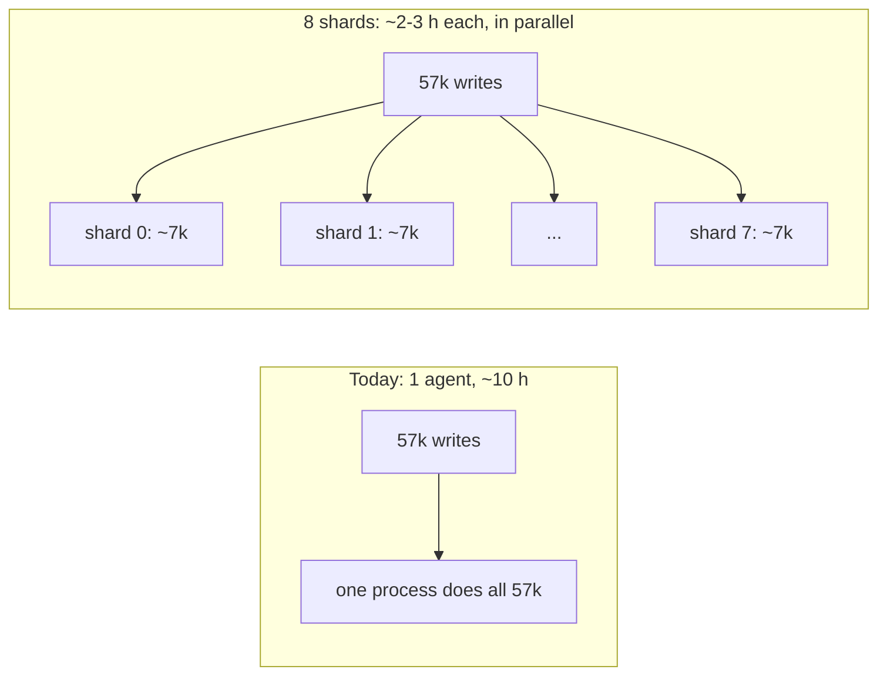
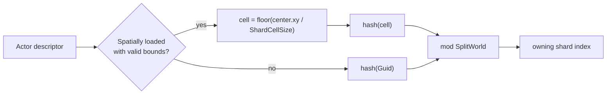
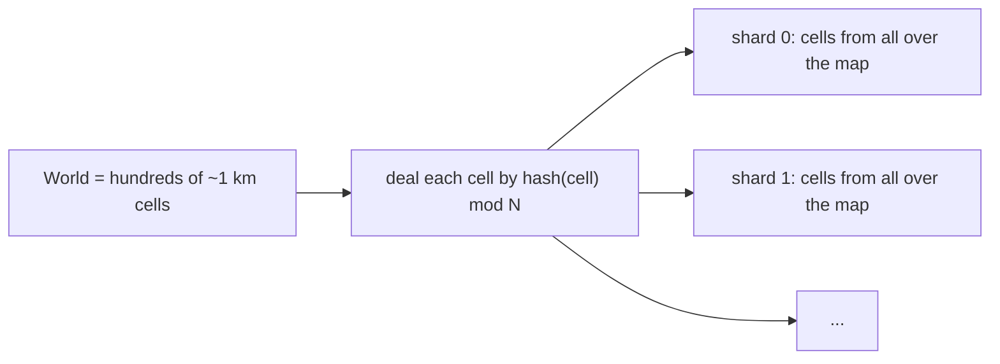
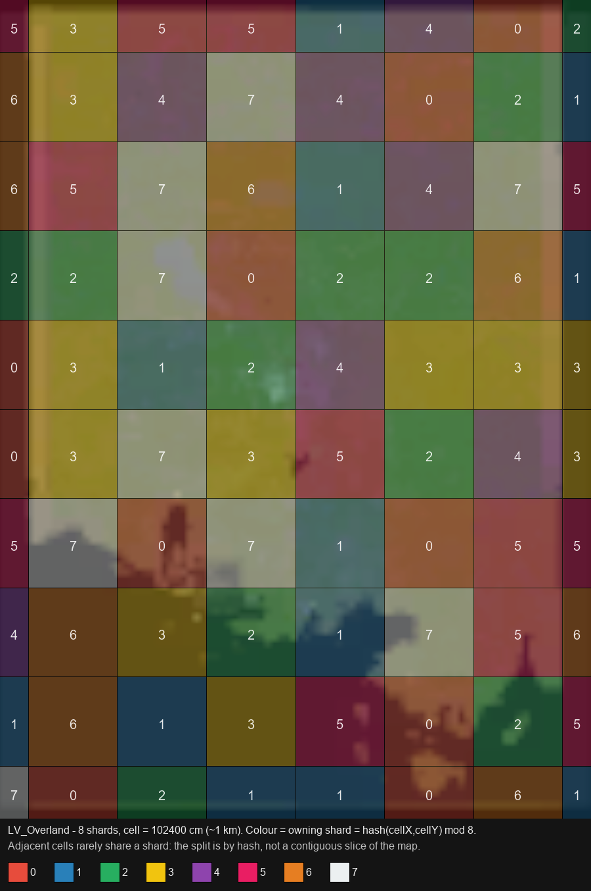
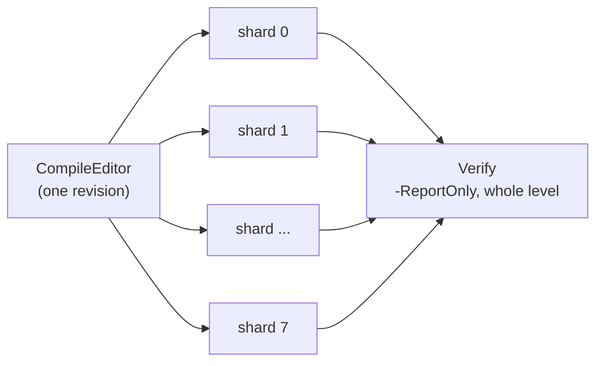

Parent: [Reference Docs](README.md)

# Parallel processing for `WorldPartitionRuleBuilder`

*Split the nightly [Apply World Partition Rules](TeamCityJobs.md#apply-world-partition-rules)
run across several agents so the 10-hour `LV_Overland` pass finishes in a 2-3 hour window.*

**Status:** the builder code (Phase 1) is implemented in the `WorldBuildingEditor` module.
Defaults reproduce today's behaviour exactly; the TeamCity fan-out (Phase 3) is the remaining work.

## Contents

- [The problem](#the-problem)
- [What is a shard](#what-is-a-shard)
- [Why this is faster](#why-this-is-faster)
- [How an actor is assigned to a shard](#how-an-actor-is-assigned-to-a-shard)
- [Load balancing and cell density](#load-balancing-and-cell-density)
- [Parameters](#parameters)
- [Testing locally](#testing-locally)
- [Deploying on TeamCity](#deploying-on-teamcity)
- [Correctness guarantees](#correctness-guarantees)
- [Downstream: the WP Rules Reviewer](#downstream-the-wp-rules-reviewer)
- [See also](#see-also)

---

## The problem

Applying World Partition rules to `LV_Overland` takes about **10 hours** on a single agent, inside
the nightly window. It is the long pole: a rule change cannot be verified the same day.

The run walks every actor descriptor, then loads and rewrites only the ones that disagree with the
rules. Measured on the 2026-10-20 `-ReportOnly` run:

| Metric | Value |
|--------|-------|
| Actor descriptors walked | 622 307 |
| Unique actors needing a write | 57 273 |

That is ~0.6 s per written actor, and **the writes are 90% of the wall clock**. Each actor is an
independent Perforce package with no ordering dependency, so the work is embarrassingly parallel.

The build is already split by outliner path (`Missions`, `Dungeons`, `LI_Hogwarts`, ...), but that
axis caps at ~3x: two regions (`Hogwarts Valley` 32%, `Stronghold_Brathborne` 15%) dominate and
cannot be subdivided by path. **The split has to cut *inside* a region** - a spatial grid does that.

## What is a shard

> A **shard** is one slice of the work plus the process that runs it. We launch the **same
> commandlet, on the same level, with the same command line** N times; a single parameter tells each
> copy "you are shard *i* of *N*". Each copy processes only the actors it owns.

A **cell** is a square of the map (a fixed grid); a **shard** is the set of cells one agent handles.
There is **no coordinator and no communication** between shards: each one computes, from each actor's
descriptor, which shard owns it. Because the computation is deterministic and identical everywhere,
the N answers fit together with **no overlap and no gap**.

> Analogy: N people get the same phone book and "handle only the names whose hash equals your
> number". Nobody talks to anybody, yet every name is handled exactly once - as long as everyone has
> the same book (one Perforce revision) and the same rule (a fixed grid, never the per-machine world
> bounds).

## Why this is faster

Only part of the work can be split. Each shard still boots its own editor, inits the world and
discovers every actor before it writes anything - that cost does **not** shrink when you add shards.
Only the actual actor writing divides up. So the wall-clock time of the whole (parallel) job is:

```
wall clock(N)  =  T_fixed  +  T_write / N
```

| Term | Meaning |
|------|---------|
| `N` | number of shards (parallel processes) |
| `wall clock(N)` | real time until the job is done - the shards run in parallel, so it finishes when the slowest one does |
| `T_fixed` | the one-time cost **every** shard pays no matter what: editor boot + world init + discovering all actors (~3 min measured). Adding shards does not divide it - each process pays it in full |
| `T_write` | the total actor-writing work (today's ~10 h). The **only** part that splits: with `N` shards each writes ~`1/N` of the actors |

Worked example with `T_fixed = 1 h` and `T_write = 9 h`:

```
N = 1:  1 + 9/1  = 10 h    (today)
N = 4:  1 + 9/4  = 3 h 15
N = 8:  1 + 9/8  = 2 h 10
```

Because `T_fixed` never divides, past a point more shards barely help (diminishing returns): the `9/N`
term shrinks toward zero but the `1 h` floor stays.


```mermaid
flowchart LR
  subgraph Today["Today: 1 agent, ~10 h"]
    T0["57k writes"] --> T1["one process does all 57k"]
  end
  subgraph Eight["8 shards: ~2-3 h each, in parallel"]
    W["57k writes"] --> S0["shard 0: ~7k"]
    W --> S1["shard 1: ~7k"]
    W --> Sd["..."]
    W --> S7["shard 7: ~7k"]
  end
```

**First measurement of the shared hit** (shard 0 of 40, `LV_Overland`, 2026-11-03). Before the
first actor is written, every shard pays the same fixed startup, measured here at **~3 min**:

| Phase | Duration | Shared by all shards? |
|-------|----------|-----------------------|
| Editor + module boot | ~1 min 40 s | yes |
| World + World Partition init - **all actor descriptors discovered here** | ~50 s | yes |
| Walk the descriptors to the first owned actor | ~35 s | yes (walk); shard 0 also runs the HLOD streaming pass the others skip |
| **Total before first write** | **~3 min** | |

So discovering every actor is a ~50 s step inside a ~3 min floor that no amount of sharding can
divide - it is the hard floor under `T_fixed`. (Bracketed from the builder's `Display` logs;
`-LogCmds=Global none` hid the engine's own phase timers, so treat these as estimates.)

The full `T_fixed` vs `T_write` split still needs a whole unsharded run. Against today's 10 hours:

| `T_fixed` | 4 shards | 8 shards |
|-----------|----------|----------|
| 30 min | 2 h 55 (3.5x) | 1 h 40 (5.9x) |
| 1 h | 3 h 15 (3.1x) | 2 h 05 (4.7x) |
| 2 h | 4 h 00 (2.5x) | 3 h 00 (3.3x) |

**Target: 8 shards → the 10-hour run in a 2-3 hour window.** 8 is also the practical ceiling: the
nightly window shares a pool of 13 agents, so N = 16 is out without growing it.

## How an actor is assigned to a shard

Decided from the descriptor alone, before anything is loaded - the test runs **first** in
`ShouldProcessActor`, so a foreign actor costs only one cheap bounds check:


```mermaid
flowchart LR
  D["Actor descriptor"] --> Q{"Spatially loaded<br/>with valid bounds?"}
  Q -- yes --> C["cell = floor(center.xy / ShardCellSize)"]
  Q -- "no" --> G["hash(Guid)"]
  C --> H["hash(cell)"]
  H --> M["mod SplitWorld"]
  G --> M
  M --> O["owning shard index"]
```

Two details carry the correctness:

- **Centre, not overlap.** An actor straddling a cell edge belongs to exactly one cell, so two
  agents never fight over the same `.uasset`.
- **Level Instances shard by their inner-level package**, not by cell. Every placement of one asset
  writes the same shared inner packages, so all placements must land on the same shard.

### `SplitWorld` is not a geometric cut

The world's shape (square, rectangle) is irrelevant: we never slice the map into `N` big blocks. The
grid covers it with **hundreds of small fixed cells** (`ShardCellSize` ≈ 1 km), and each cell is then
**dealt to a shard by hash**, like dealing a deck of cards to `N` players:


```mermaid
flowchart LR
  R["World = hundreds of ~1 km cells"] --> D["deal each cell by hash(cell) mod N"]
  D --> P0["shard 0: cells from all over the map"]
  D --> P1["shard 1: cells from all over the map"]
  D --> Pd["..."]
```

Here is what that looks like on the real `LV_Overland`. Its footprint is about **6.8 km x 9.4 km**
(`680 000 x 940 000 cm`), so a `102 400 cm` (~1 km) cell gives an **8 x 10 grid of ~80 cells**, each
dealt to one of `N = 8` shards by `hash(cell) mod 8`:



Note the checkerboard: neighbouring cells almost never share a colour. Each shard ends up with a
handful of cells scattered across the whole map - dense and sparse ones mixed - which is exactly what
balances the load.

So **any positive `N` works** - `5`, `7`, `13`, no need for a power of two or an even divisor. `N`
only has to divide the *cell count*, not the world's geometry, and interleaving by hash is what keeps
each shard balanced even though dense regions (Hogwarts Valley) sit in one corner.

Practical caps (waste, not errors): `N` far above the cell count leaves some shards nearly empty, and
`N` above the agent pool (13) cannot run fully in parallel. `N < 1` is clamped to `1`.

## Load balancing and cell density

Density varies by orders of magnitude: `Hogwarts Valley` holds 32% of the writes, other cells almost
none. Balance - making the shards equal-sized - is what sets the wall clock, since the heaviest shard
is the long pole.

The hash deal handles this at the **region** level. A dense region is not one cell but *many* cells,
and those cells scatter across every shard, so no shard ever gets "all of Hogwarts Valley". Each shard
draws a mix of dense and light cells that **averages out by the law of large numbers** - as long as
there are far more cells than shards. This is exactly what the contiguous outliner-path split could
not do.

The limit: a **cell is atomic** - it is never split. So the single heaviest cell sets a floor on the
wall clock, no matter how large `N` is (the same "heaviest group wins" effect as today, but at a much
finer grain). The lever is **`ShardCellSize`** - a fixed code constant (`102400` cm ≈ 1 km), not a
command-line switch: small enough that a dense region breaks into many lighter, independently-dealt
cells → better balance and a lower floor, without being so small that cells turn to overhead and
near-empty noise. If future measurements show the heaviest shard running too long, shrink the constant
in code and rebuild until that shard is within ~15% of the mean.

Two caveats worth knowing:

- The hash balances **statistically**, not by weight. It is not a bin-packing that counts actors per
  cell - that would need a counting pre-pass, i.e. a coordinator, which would break the "no
  communication, fully deterministic" property. Statistical balance is the deliberate trade-off.
- Cost tracks the **~57k actors needing a write**, not the 622k descriptor walk (which is roughly
  uniform). Non-spatial / invalid-bounds actors are spread by `hash(Guid)`, which is naturally even.

## Parameters

Builder switches (`WorldPartitionRuleBuilder`); defaults = today's behaviour, bit for bit:

| Switch | Default | Meaning |
|--------|---------|---------|
| `-SplitWorld=N` | `1` | Number of shards. `1` = no sharding. |
| `-SplitWorldStartAt=I` | `0` | Which shard this process is, 0-based. |
| `-CellCoord=X,Y` | — | Dev-only: process just one cell ("redo this area"). |

The switch names follow the `UAvaWorldPartitionBuilder` convention. The sharding cell is a fixed
`102400` cm (~1 km) square grid anchored at the world origin - a **code constant**, not a switch.

In `-ReportOnly`, the JSON report also carries `ShardCount` / `ShardIndex` / `ShardCellSize` so the
disjointness check (below) can tell the sharded reports apart.

## Testing locally

No agents and no writes needed - `-ReportOnly` only reads descriptors. The key test proves the whole
design in one shot: **the N shards cover every actor exactly once.**

```bat
:: 1) The reference: the usual unsharded run (no -SplitWorld, so it defaults to 1).
::    Only difference from a normal -ReportOnly run is the output filename.
UnrealEditor-Cmd.exe Sundance -run=WorldPartitionBuilderCommandlet -Builder=WorldPartitionRuleBuilder ^
  -DataLayerRules -HLODLayerRules -RuntimeGridRules -ReportOnly ^
  -ReportFile=report-ref.json  <LevelPath>

:: 2) The 4 shards: same run + -SplitWorld=4 and a shard index, all on the same revision.
UnrealEditor-Cmd.exe Sundance -run=WorldPartitionBuilderCommandlet -Builder=WorldPartitionRuleBuilder ^
  -DataLayerRules -HLODLayerRules -RuntimeGridRules -ReportOnly ^
  -SplitWorld=4 -SplitWorldStartAt=0 -ReportFile=report-0.json  <LevelPath>
:: ... repeat for -SplitWorldStartAt=1, 2, 3
```

Then assert, over the `ActorPath` sets in the five reports:

- **union** of shards 0-3 **== reference** (completeness: nobody is missed);
- all pairwise **intersections empty** (disjointness: nobody is processed twice).

Other useful local runs:

```bat
:: one real shard, left pending for review instead of submitted
ApplyWorldPartitionRules.bat -StayPending ... -SplitWorld=4 -SplitWorldStartAt=2

:: redo a single map area after a local fix
UnrealEditor-Cmd.exe ... -Builder=WorldPartitionRuleBuilder -CellCoord=12,7 <LevelPath>
```

## Deploying on TeamCity

TeamCity is on 2024.12.3, so the built-in **Matrix Build** feature applies. Keep the **same build
configuration** and add two parameters, then a matrix dimension over the shard index:

| TeamCity parameter | Default | Maps to |
|--------------------|---------|---------|
| `wp-rules.split_count` | `1` | `-SplitWorld` |
| `wp-rules.split_index` | `0` | `-SplitWorldStartAt` |

1. **Dark launch.** Append `-SplitWorld=%wp-rules.split_count% -SplitWorldStartAt=%wp-rules.split_index%`
   to the Apply step. With the defaults it behaves exactly as today, so it can ship and bake for a week.
2. **Fan out.** Make `wp-rules.split_index` a Matrix dimension `0..7`. TeamCity creates 8 parallel
   builds plus a composite head, each on its own agent and Perforce workspace, each submitting its
   own changelist (the actor sets are disjoint, so the submits never collide).
3. **Pin the revision.** All shards take a snapshot dependency on the same `CompileEditor` build -
   this is the "same phone book" guarantee.
4. **Verify.** A `..._Verify` build depends on all shards and re-runs `-ReportOnly` over the whole
   level; it fails if the finding count rises above tolerance.


```mermaid
graph LR
    C["CompileEditor<br/>(one revision)"] --> S0["shard 0"]
    C --> S1["shard 1"]
    C --> Sd["shard ..."]
    C --> S7["shard 7"]
    S0 --> V["Verify<br/>-ReportOnly, whole level"]
    S1 --> V
    Sd --> V
    S7 --> V
```

## Correctness guarantees

| Risk | Closed by |
|------|-----------|
| Actor claimed by two shards | Centre-based cell ownership - no overlap by construction. |
| Actor claimed by no shard | Assignment is a total function of the descriptor. |
| Shards compute different grids | Fixed origin + fixed cell size; never the per-machine world bounds. |
| Shards on different revisions | TeamCity snapshot dependency pins one revision. |
| Level Instance placements split | Sharded by inner-level container package. |
| Shared `.umap` / `WorldDataLayers` written by many | Only shard 0 writes them; any other shard that needs to fails loudly. |
| One shard fails | Composite fails; existing revert/cleanup steps run `execute_always`. |

Both set-based properties are proven by the [local disjointness test](#testing-locally), cheap enough
to keep as a recurring CI check.

**Open question - nested Level Instances.** A nested Level Instance reachable only through a parent
owned by a different shard could be missed. This is tied to the existing placement-dedup question
(the same asset placed *k* times is processed *k* times today), which needs a World Building ruling
before it is touched. The whole-level `-ReportOnly` Verify step surfaces any resulting miss.

## Downstream: the WP Rules Reviewer

The [WP Rules Reviewer](../Tools/WPRulesReviewer/) lists recent TeamCity builds of the Apply / Validate
config and reviews **one whole-level log per build**, comparing the actor population against an oracle.
Sharding breaks that "one build = one full-level log" assumption, so the tool needs:

- **Group the fan-out.** A run becomes N shard sub-builds plus a composite head under the *same* build
  config, so the build list shows ~8x more entries. List the composite (or group the shards) instead
  of treating each shard as a standalone full run.
- **Merge the shard logs.** Each shard log covers only ~1/N of the actors, so the oracle comparison and
  the counts are meaningless on one shard alone. Download all N and merge (and dedup) before analysis.
- **Aggregate counts** - `FindingCount` / `ActorsConsidered`, and the parsed applied / warning / skipped
  totals - across the N shards.
- **Carry shard identity.** Read `ShardIndex` / `ShardCount` from the report (or the `i/N` suffix in the
  build number) to label and group shards, and handle **N changelists per run** instead of one.

**Simplest path:** add the new `..._Verify` build as a review source (a third `BuildSourceKind`). Its
whole-level, unsharded `-ReportOnly` report is the single complete, authoritative population, so the
reviewer's existing "one build = one report" model keeps working unchanged; per-shard drill-down on the
Apply tab is then optional, not required.

## See also

- [TeamCity jobs](TeamCityJobs.md) - the Apply/Validate configurations, parameters and schedule.
- [`-ReportOnly` vs `-ValidateOnly`](ReportOnlyVsValidateOnly.md) - the read-only modes this plan uses.
- [Builders & commandlets](BuildersAndCommandlets.md#uworldpartitionrulebuilder) - the builder being modified.
- [World Partition builders catalog](WorldPartitionBuildersCatalog.md) - every WP builder, including the Pipeline builder this design borrows `-SplitWorld` from.
