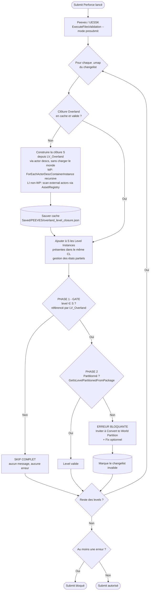
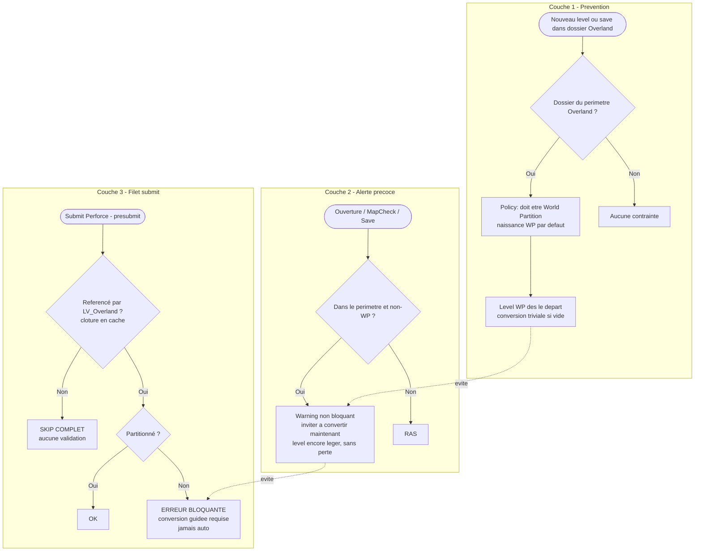

# Peeves Validation Nonpartitioned Level Plan Flowchart

- Date: 2026-07-06 14:21
- Source transcript: `592fa869-70f6-4d38-bc6d-bacf20de6acd`

---

### User

on a un systeme s'appelle Peeves et qui fait de la validation.
je veux desormais qu'on affiche une erreur si un level qu'on s'apprete a submitter dans Perforce est un Level non partitionné. il faut inviter l'utilisateur a partitionner le level
il faut trouver un moyen rapide et efficace pour valider que le level est referencé par le level "LV_Overland" , meme avec le systeme de level instances imbriqués.
je veux que l'on etablisse un plan sur ce qui est possible de faire

**Assistant:** Je vais explorer le codebase pour comprendre le système "Peeves" et son fonctionnement avant de proposer un plan.

I need to understand what the user is trying to accomplish with their Peeves validation system. They want to catch cases where a level is about to be submitted to Perforce without being properly partitioned, and they're looking for an efficient way to validate that the level is referenced by the "LV_Overland" level even when there are nested level instances involved. Let me start by exploring the codebase to see what we're working with.

Tools used

- `Task` Explore Peeves validation system

**Assistant:** Excellent contexte. Le projet réel est dans `D:\Sun\Sundance`. Laisse-moi lire les fichiers clés pour concevoir un plan concret et réaliste.

I found the actual project location at D:\Sun\Sundance rather than the sandbox path. Now I need to examine the key integration points: the Python changelist verifier, the per-file validation logic, and the LevelInstanceFunctionLibrary to understand how to identify non-partitioned levels and navigate the world partition hierarchy.

Tools used

- `Read` D:\Sun\Sundance\Source\WorldBuildingEditor\WorldPartition\LevelInstance\LevelInstanceFunctionLibrary.cpp
- `Read` D:\Sun\Sundance\Source\WorldBuildingEditor\WorldPartition\WorldPartitionMapCheckValidator.cpp

**Assistant:** Laisse-moi comprendre le côté "référencé par LV_Overland" et l'infra Python de validation par fichier.

I need to understand how the validation system works in verify_files.py and verify_changelist.py, and then figure out how to efficiently check if a submitted level is actually referenced by LV_Overland through the nested level instance hierarchy. This is essentially a reverse dependency lookup problem, and I'm considering different approaches to compute it.

The key insight is that using AssetRegistry's GetReferencers won't work directly because level instances reference worlds through external actor packages, not as hard package dependencies visible to the standard registry. Since LV_Overland is a huge world map, I can't just load it to check references. Instead, I need to traverse the actor descriptor hierarchy without loading the full map, using the outliner path registry and actor descriptor containers to build the tree of referenced worlds.

Tools used

- `Read` D:\Sun\Sundance\Source\WorldBuildingEditor\WorldPartition\LevelInstance\LevelInstanceFunctionLibrary.cpp
- `Read` D:\Sun\Sundance\Plugins\AvaPython\Content\Python\PEEVES\Scripts\Verifiers\verify_files.py

**Assistant:** I'm grasping the core technical issue now—LV_Overland is a World Partition map with externally stored actors, so when it references a sub-level's world asset, that's not a direct package dependency of the LV_Overland.umap file itself. The reference exists at a different level of the asset hierarchy.

**Assistant:** Laisse-moi vérifier comment `verify_changelist.py` itère sur les assets et le point d'insertion exact, ainsi que la disponibilité d'une API de référence inverse via l'AssetRegistry.

I'm gathering the technical details I need—checking how verify_changelist.py determines asset types and whether there's already a mechanism for tracking "referenced by" relationships. I think I have enough context now to outline a solid approach.

The validation flow runs through C++ → Python scripts → the editor validator subsystem. There's a fast, no-load check available via `ULevel::GetIsLevelPartitionedFromPackage()` that I can use to detect non-partitioned levels without loading them. For the first requirement, I'd hook into verify_changelist.py or create a new validator for World assets at pre-submit time—checking each .umap in the changelist and erroring if it's not partitioned, with a message suggesting conversion to World Partition. For the second requirement, I need to validate that the level is actually referenced by LV_Overland, but the challenge is that OFPA and external actors mean the asset registry won't directly show those reverse-references from the LV_Overland package to sub-levels.

The efficient approach is forward traversal from LV_Overland: build a transitive closure of all world packages reachable through level instances by reading actor descriptors from the asset registry without loading heavy actors. Since level instance actor descriptors store the referenced world package as a property, I can traverse recursively through the actor desc container instances to collect all reachable worlds, then check if the submitted level is in that set. This could be cached and invalidated when LV_Overland's level instance structure changes. For each external actor package, I can derive its owning world from the path structure, which opens up a reverse-reference approach: query the AssetRegistry for packages that reference a given level, map those external actor packages back to their owning worlds, then recurse upward until reaching LV_Overland. This bottom-up strategy is likely more efficient than traversing the entire Overland tree, since a single level's ancestry is typically much smaller than the full 98-LevelInstance hierarchy. I'll present both approaches in the plan with a recommendation, focusing on concrete hook points and the exact feasibility of the actor descriptor reverse-reference method.

Tools used

- `Read` D:\Sun\Sundance\Plugins\AvaPython\Content\Python\PEEVES\Scripts\Verifiers\verify_changelist.py
- `Grep` GetIsLevelPartitionedFromPackage|is_level_partitioned|IsPartitionedWorld|GetReferencers|get_referencers

**Assistant:** Regardons ce qui existe déjà côté Python pour les worlds et le partitionnement.

Let me check what's already available in the Python codebase by looking at the world asset class in world.py and the partition validation logic in unreal_helpers.py.

Tools used

- `Read` D:\Sun\Sundance\Plugins\AvaPython\Content\Python\PEEVES\Core\Assets\world.py
- `Grep` partition|Partition

**Assistant:** J'ai maintenant une vision claire du système. Voici mon analyse et le plan proposé.

## Ce que fait Peeves aujourd'hui (état des lieux)

Le gate de validation avant submit Perforce passe par le plugin maison **UESSK / WPerforceControl**, pas par le delegate stock d'Unreal (celui-ci est volontairement court-circuité dans `SSourceControlChangelists.cpp`). Le flux est :

1. `FWPerforceControlDataValidation::ExecuteFilesValidation_*` (C++)
2. → `ValidateChangelist_Peeves` lance `verify_changelist.py`, et `ExecuteValidationFile_Peeves` lance `verify_files.py` (avec `--mode presubmit`)
3. → `PeevesScriptHelpers::IsChangelistValid` exécute en plus tous les `UEditorValidatorBase` en `EDataValidationUsecase::PreSubmit`

Deux constats importants pour tes besoins :

- **Partitionnement** : il existe déjà `UWorldPartitionMapCheckValidator::CheckWorldPartitionLevelInstance` qui **avertit** (warning MapCheck + bouton "Fix It!" qui convertit en WP), mais uniquement à l'ouverture/MapCheck, et **côté world persistant** — ça ne **bloque pas** un submit d'un level non partitionné. Il existe surtout la primitive **rapide et sans chargement** `ULevel::GetIsLevelPartitionedFromPackage(PackageName)` (utilisée dans `LevelInstanceFunctionLibrary.cpp:865`), idéale pour un check pré-submit.
- **Référencé par `LV_Overland`** : il n'existe **aucune** règle qui vérifie ça. Et un simple `GetReferencers` de l'AssetRegistry ne suffira **pas** : avec World Partition + OFPA (One File Per Actor), `LV_Overland` ne référence pas directement le package du sous-level — c'est le package de l'*external actor* (le `ALevelInstance`) qui pointe vers le world. Il faut donc parcourir la hiérarchie des Level Instances.

## Plan proposé

### Objectif 1 — Bloquer le submit d'un level non partitionné

- Ajouter une règle Peeves qui, en mode `presubmit`, pour chaque `.umap` du changelist, appelle `ULevel::GetIsLevelPartitionedFromPackage(package)` (aucun chargement du level → très rapide).
- Si non partitionné et non exempté → **erreur** avec message d'invitation à partitionner (« Ce level n'utilise pas World Partition. Convertissez-le via *Convert to World Partition* avant de submit. »).
- Exemptions via `peeves.ini.json` (levels `_LOD`, maps de test, HLOD, etc. — il y a déjà `is_level_lod` et des listes par level dans `world.py`).
- Option confort : proposer un *Fix* qui déclenche `ULevelInstanceFunctionLibrary::ConvertLevelToWorldPartition` comme le fait déjà le MapCheck validator.

C'est la partie simple et à faible risque (quick win).

### Objectif 2 — Vérifier que le level est référencé par `LV_Overland` (Level Instances imbriquées incluses)

C'est la partie technique. Le point clé pour la performance : **ne jamais charger `LV_Overland`** (map WP énorme). On travaille au niveau des *actor descs* / AssetRegistry, sans instancier le monde. Deux stratégies possibles :

**Approche A — Ascendante (reverse), depuis le level soumis**
- Depuis le package du level, `GetReferencers` → packages d'external actors qui le référencent → on remonte au world "propriétaire" de ces actors (via la convention de chemin `__ExternalActors__`), puis on répète jusqu'à atteindre `LV_Overland` ou épuisement.
- Avantage : on n'explore que l'ascendance d'un seul level (peu de nœuds).
- Inconvénient : dépend de la convention de chemin des external actors et gère plus délicatement les maps non-WP.

**Approche B — Descendante (forward), clôture depuis `LV_Overland` + cache** *(recommandée)*
- Construire une fois l'ensemble `S` = clôture transitive de tous les world packages atteignables depuis `LV_Overland` via les Level Instances, en réutilisant exactement le pattern déjà présent dans `LevelInstanceFunctionLibrary::GetNonPartitionedLevelInstances` : `ForEachActorDescContainerInstance(recursive=true)` pour le WP, et scan des external actors `LevelInstance` via l'AssetRegistry pour les maps imbriquées — **sans charger les actors**.
- Test d'appartenance : `submittedLevel ∈ S ?` → O(1).
- **Cache** dans `Saved/PEEVES/overland_level_closure.json`, invalidé quand `LV_Overland` ou un des sous-levels change (timestamp/hash P4). La reconstruction ne se fait qu'à froid.
- Avantage : robuste, réutilise du code éprouvé, gère nativement le LI-dans-LI (WP et non-WP). Inconvénient : calcule toute la clôture (~une centaine de LI d'après les logs de conversion), d'où le cache.

**Recommandation** : Approche B avec cache. Le calcul lourd est fait en C++ (perf + réutilisation de `LevelInstanceFunctionLibrary`), exposé à Python via `PeevesScriptHelpers`, et la *politique* (erreur/exemptions/message) reste en Python dans la règle Peeves.

### Points d'attention / décisions

- **Faux positifs** : un level tout neuf pas encore branché dans Overland déclenchera l'erreur — c'est justement le but, mais il faut une **liste d'exemptions** claire (levels standalone, cinématiques, biomes de test, `_LOD`, HLOD).
- **États partiels** : un level peut être référencé uniquement via une autre LI elle-même dans le même changelist → penser à inclure les LI du CL dans la clôture avant de conclure.
- **Sévérité** : erreur bloquante vs warning ? (je pars sur erreur bloquante par défaut, alignée avec ta demande).

### Découpage en phases

1. **Phase 1** — Check partitionnement (règle + message + exemptions). Rapide, autonome.
2. **Phase 2** — Helper C++ de clôture `LV_Overland` + cache, exposé à Python.
3. **Phase 3** — Règle Peeves "référencé par Overland" (message + exemptions) branchée en `presubmit`.
4. **Phase 4** — Tests (levels partitionné/non, référencé/non, LI imbriquée profonde) + validation perf sur un vrai CL.

Avant de me lancer sur l'implémentation, deux points à confirmer :

I see that `World.verify()` already handles level loading through the commandlet, and there's `is_world_partition()` available, but loading the level just to check partitioning is expensive. Using `ULevel::GetIsLevelPartitionedFromPackage` would be more efficient for pre-submit checks since it doesn't require loading. Now I have the full picture and can outline the approach the user requested.

For the first requirement, I need to add a Peeves validator rule specifically for World assets in PreSubmit mode that uses the fast package-level partition check, with a message encouraging partitioning and optionally offering a conversion action. For the second requirement around detecting references from LV_Overland, the challenge is that naive AssetRegistry lookups fail because of external actor packages and indirect level instance references. I'm considering two strategies: a bottom-up approach that traces referencers back through external actor packages to find owning worlds, or a top-down approach that traverses the level instance hierarchy without loading actors to build a complete set of referenced world packages.

I'm leaning toward the top-down approach with caching since it's more robust and reuses existing actor descriptor traversal patterns already in the codebase, though it requires computing the full closure upfront. The caching strategy would store the computed closure in Saved/PEEVES and invalidate it when needed. I also need to handle edge cases like intentionally standalone levels, nested level instances referenced only through other non-Overland maps, and performance concerns around not loading the massive LV_Overland world itself. For implementation, I'm thinking a C++ helper function to compute the closure efficiently, exposed to Python through PeevesScriptHelpers, with the actual validation policy and exemptions managed in Python for flexibility.

I'll structure this as a phased rollout: first a quick partition check, then the closure helper with caching, then the full reference validation rule with exemptions and messaging, and finally tests. I should present this plan clearly and ask a couple of targeted questions about scope—like whether we want to block or warn on violations, and how to handle exemptions—but keep it focused since the user wants the plan established.

Tools used

- `AskQuestion`

**Assistant:** Parfait, je reste au niveau du plan. Voici le plan **finalisé** avec tes choix intégrés (erreur bloquante, approche B avec cache).

## Plan validé

**Décisions retenues**
- Level non partitionné au submit → **erreur bloquante**.
- Level non référencé par `LV_Overland` au submit → **erreur bloquante**.
- Détection "référencé par Overland" → **Approche B** : clôture transitive descendante depuis `LV_Overland` via les *actor descs* (sans charger le monde), mise en **cache**.

### Phase 1 — Check partitionnement (autonome)
- Nouvelle règle Peeves en mode `presubmit`, sur chaque `.umap` du changelist.
- Détection rapide sans chargement : `ULevel::GetIsLevelPartitionedFromPackage(PackageName)`.
- Non partitionné + non exempté → **erreur** : « Ce level n'utilise pas World Partition. Convertissez-le (*Convert to World Partition*) avant de submit. »
- Exemptions dans `peeves.ini.json` (`_LOD`, HLOD, maps de test/standalone).
- Nouvelle entrée `verify_errors` (id + message + doc URL).
- Option : action *Fix* → `ULevelInstanceFunctionLibrary::ConvertLevelToWorldPartition`.

### Phase 2 — Helper de clôture `LV_Overland` + cache (C++)
- Nouvelle fonction (dans/à côté de `LevelInstanceFunctionLibrary`) qui construit `S` = ensemble des world packages atteignables depuis `LV_Overland` via Level Instances, en réutilisant le pattern existant :
  - WP : `ForEachActorDescContainerInstance(recursive=true)`,
  - LI imbriquées non-WP : scan des external actors `LevelInstance` via l'AssetRegistry — **sans instancier les actors**.
- Cache `Saved/PEEVES/overland_level_closure.json`, invalidé si `LV_Overland` ou un sous-level change (timestamp/hash).
- Exposition à Python via `UPeevesScriptHelpers`.

### Phase 3 — Règle "référencé par LV_Overland"
- En `presubmit` : pour chaque `.umap` du CL, test d'appartenance O(1) à `S`.
- Prise en compte des **états partiels** : ajouter à `S` les LI présentes dans le même changelist avant de conclure (évite les faux positifs quand le chaînon est aussi dans le CL).
- Non référencé + non exempté → **erreur** : « Ce level n'est pas référencé par LV_Overland (directement ou via une Level Instance imbriquée). Branchez-le dans la hiérarchie Overland avant de submit. »
- Exemptions dédiées dans `peeves.ini.json`.

### Phase 4 — Tests & perf
- Cas : partitionné/non, référencé direct, référencé via LI profonde, non référencé, exempté.
- Mesure du coût sur un vrai CL (froid vs cache chaud) pour garantir qu'on ne charge jamais `LV_Overland`.

Dis-moi quand tu veux que je passe à l'implémentation (je recommande de démarrer par la Phase 1) et je m'y mets.

The user wants to stay at the planning level with error severity and approach B, so I'll finalize the plan concisely without generating code yet.

---

### User

ajuste le plan
"Level non référencé par LV_Overland au submit → erreur bloquante." -> NON
si le level n'est PAS referencé par LV_Overland, alors on skip completement la validation. c'est a tester en 1er

**Assistant:** Compris, ça inverse la logique. La vérification "référencé par `LV_Overland`" n'est plus une erreur : c'est un **filtre d'entrée (gate)**. On le teste **en premier**, et s'il est négatif on **skip complètement** la validation du level.

## Plan ajusté

**Nouvelle logique (ordre d'exécution en `presubmit`, pour chaque `.umap` du CL)**
1. **Gate — référencé par `LV_Overland` ?** (testé en 1er)
   - Non référencé (directement ou via Level Instance imbriquée) → **skip complet** de la validation de ce level. Aucun message, aucune erreur.
   - Référencé → on continue.
2. **Check partitionnement** (uniquement si gate passé)
   - Non partitionné → **erreur bloquante** + invitation à partitionner.

Donc `LV_Overland` définit le périmètre : seuls les levels appartenant à la hiérarchie Overland sont soumis au check de partitionnement. Un level standalone / hors-Overland n'est plus concerné du tout (ça remplace avantageusement la logique d'exemptions manuelles pour le hors-périmètre).

### Phase 1 — Gate "référencé par LV_Overland" (à faire EN PREMIER)
- **Approche B** : clôture transitive descendante depuis `LV_Overland` via les *actor descs*, **sans charger le monde**, mise en cache.
  - WP : `ForEachActorDescContainerInstance(recursive=true)`.
  - LI imbriquées non-WP : scan des external actors `LevelInstance` via l'AssetRegistry.
  - Réutilise le pattern de `LevelInstanceFunctionLibrary::GetNonPartitionedLevelInstances`.
- Cache `Saved/PEEVES/overland_level_closure.json`, invalidé si `LV_Overland` ou un sous-level change.
- Test d'appartenance O(1) : `submittedLevel ∈ S ?`.
- **États partiels** : ajouter à `S` les LI présentes dans le même changelist avant de conclure (évite de skip à tort quand le chaînon de rattachement est lui aussi dans le CL).
- Helper C++ exposé à Python via `UPeevesScriptHelpers`.
- Livrable de cette phase : la fonction `is_level_referenced_by_overland(package)` + validation de perf (froid vs cache chaud, jamais de chargement de `LV_Overland`).

### Phase 2 — Check partitionnement (derrière le gate)
- Sur les levels ayant passé le gate uniquement.
- Détection rapide sans chargement : `ULevel::GetIsLevelPartitionedFromPackage(PackageName)`.
- Non partitionné → **erreur bloquante** : « Ce level (référencé par LV_Overland) n'utilise pas World Partition. Convertissez-le avant de submit. »
- Nouvelle entrée `verify_errors` (id + message + doc URL) dans `peeves.ini.json`.
- Option *Fix* : `ULevelInstanceFunctionLibrary::ConvertLevelToWorldPartition`.

### Phase 3 — Tests & perf
- Cas : référencé + partitionné (OK), référencé + non partitionné (erreur), non référencé (skip total, même si non partitionné), référencé via LI profonde, chaînon dans le même CL.
- Vérifier qu'on ne charge jamais `LV_Overland` et que le cache chaud est quasi instantané.

Le reste (points d'attention, hooks Peeves/UESSK) est inchangé. Je commence par la Phase 1 quand tu me le dis.

The approach needs to flip: instead of throwing an error when a level isn't referenced by LV_Overland, I should use that check as a gate that determines whether validation runs at all. If a level isn't part of Overland, skip the entire validation process. This check needs to happen first, before any other validation logic kicks in.

---

### User

peux-tu faire un flowchat de ce plan ?

**Assistant:** Voici le flowchart du plan (logique d'exécution au pré-submit).

Points clés illustrés :
- Le **gate "référencé par LV_Overland"** est évalué en premier ; s'il échoue → skip total (pas d'erreur).
- Le **check de partitionnement** ne s'exécute que sur les levels du périmètre Overland.
- La **clôture est mise en cache** et jamais recalculée à chaud ; `LV_Overland` n'est jamais chargé.
- Les **états partiels** (chaînon de rattachement dans le même CL) sont gérés avant de décider du skip.

Dis-moi si tu veux que j'ajoute le détail interne de la construction de la clôture (récursion LI-dans-LI) dans un second diagramme, ou qu'on passe à l'implémentation de la Phase 1.

I'll create a Mermaid flowchart to visualize the plan for the user.

---

### User

penses-tu que le processing de "reference par LV_Overland" est long ?

**Assistant:** Honnêtement : **ça dépend fortement du chemin (froid vs chaud), mais ce n'est pas censé être long si c'est bien fait.** Voici mon évaluation.

## Ce qui coûte cher vs pas cher

**Ce qu'on ne fait JAMAIS** : charger `LV_Overland` (map WP énorme → minutes). Tout le plan repose là-dessus. Si on lisait le monde, ce serait rédhibitoire.

**Cache chaud** (cas nominal, la clôture existe déjà) :
- Test d'appartenance `level ∈ S` → lecture d'un `Set` → **négligeable** (< 1 ms par level).
- C'est le cas de 99 % des submits.

**Construction à froid** (1re fois / cache invalidé) : c'est le seul moment potentiellement coûteux. Le coût dépend de **comment** on lit la hiérarchie :

| Méthode | Chargement | Coût estimé (froid) |
|---|---|---|
| Via **AssetRegistry** (tags des external actors, filtrés classe `LevelInstance`) | aucun actor chargé | rapide — **~qq secondes** |
| Via **actor desc containers** enregistrés | descs seulement | intermédiaire — **secondes à dizaines de s** |
| Via chargement du monde | tout | **inacceptable (minutes)** |

Avec ~98 Level Instances converties (d'après tes logs) + imbrication, on parle de l'ordre de **quelques milliers de requêtes AssetRegistry** au pire, scannées seulement sur les dossiers `__ExternalActors__` des worlds de la clôture (pas tout le projet). C'est du **metadata**, pas du chargement d'assets → ça reste raisonnable.

## Les vrais risques à surveiller

1. **AssetRegistry pas encore scanné** sur les chemins concernés → premier accès plus lent (il déclenche le scan). Mitigation : c'est déjà scanné dans un éditeur ouvert.
2. **Invalidation trop agressive** du cache : si on rebuild dès que *n'importe quel* sous-level bouge, on retombe souvent sur le froid. Mitigation : invalidation ciblée + rebuild asynchrone/en tâche de fond.
3. **Volume d'external actors** : filtrer par classe `LevelInstance` dans la requête AssetRegistry, sinon on itère des dizaines de milliers d'actors pour rien.

## Alternative si le froid est trop lent

L'**Approche A (ascendante)** ne construit pas toute la clôture : depuis le level soumis, on remonte via `GetReferencers` seulement son ascendance (une poignée de nœuds) jusqu'à `LV_Overland`. Par-submit, ça peut être **plus rapide que le froid de B**, au prix d'un peu plus de logique sur les conventions OFPA. Avec le cache, B reste gagnant sur les submits répétés.

## Ma recommandation

Je ne peux pas te garantir un chiffre sans mesurer sur ta machine et ton workspace. Le plus sûr est un **micro-prototype de mesure** avant de figer l'archi :
- construire la clôture via AssetRegistry et **chronométrer froid vs chaud**,
- comparer avec un essai ascendant (Approche A) sur un level réel.

Veux-tu que je code ce petit prototype de mesure (Phase 0) pour trancher sur des vrais chiffres, plutôt que de parier sur B à l'aveugle ?

I'm thinking through whether the "referenced by LV_Overland" processing would be expensive. LV_Overland is a substantial world with around 98 level instances from the conversion logs, and Approach B would need to build a transitive closure by recursively enumerating actor descriptions from its WP container without actually loading the actors themselves. The cold build cost would be significant since it requires traversing the entire actor description hierarchy.

The key insight is that at presubmit time, the editor world might not have LV_Overland open, so we'd need to read actor descriptions from the AssetRegistry instead of loading the world directly. For level instances specifically, the actor description stores the referenced world package as metadata tags in the asset registry, so we can traverse the hierarchy by looking up external actor packages and recursively following their level instance references. This is purely metadata lookups through the AssetRegistry, which should be reasonably fast, though with around 100 level instances to process, it could still add noticeable overhead.

The tradeoff is clear: a warm cache makes this negligible, but a cold build without the world loaded could take several seconds depending on how many external actors we need to scan. The reverse approach of just checking ancestry would be much cheaper for a single level, which might be worth reconsidering for the per-submit hot path, though the cache makes approach B more efficient overall.

I should give you a concrete assessment with rough numbers and suggest we could prototype this to measure the actual cost if you want certainty.

---

### User

il y a quand meme quelque chose qui me derange. Peeves fait la validation au niveau du submit. cela veut dire que l'artiste peut avoir travailler dans la map et s'appercevoir que cela prend une conversion -> c'est fastidieux et convertir pourrait introduire une perte de data

**Assistant:** C'est une **excellente objection**, et elle touche au vrai problème de fond : valider au submit, c'est **valider trop tard**. Le submit doit rester un dernier filet de sécurité, pas le premier moment où l'artiste apprend qu'il y a un problème. Deux risques que tu pointes, tous les deux réels :

1. **UX fastidieuse** : l'artiste découvre au submit qu'il faut convertir, après avoir bossé.
2. **Perte de data** : `ConvertLevelToWorldPartition` sur un level déjà bien rempli est une opération lourde, non triviale, qui peut altérer/perdre des données si faite à la va-vite.

## Le principe : "shift-left" (détecter au plus tôt)

L'idéal est de **prévenir** qu'un level non partitionné entre dans le périmètre Overland, plutôt que de le **rattraper** au submit. Plus on détecte tôt, moins la conversion est coûteuse (un level vide ou quasi vide se convertit sans risque). Il y a plusieurs points d'accroche déjà présents dans le code :

| Moment | Hook existant | Intérêt | Limite |
|---|---|---|---|
| **Création du level** | template / policy de dossier | Le level naît WP → **zéro conversion, zéro perte** | Ne couvre pas l'existant |
| **Ouverture / MapCheck** | `FEditorDelegates::OnGameMapChecked` (déjà utilisé par `WorldPartitionMapCheckValidator`) | Avertit dès l'ouverture | L'artiste peut ignorer le warning |
| **Placement d'une Level Instance non-WP** dans une map du périmètre | logique LI | Bloque/averti au moment du rattachement à Overland | Nécessite de détecter le périmètre live |
| **Save** | Peeves `VerifyMode.Save` (déjà supporté) | Averti à chaque sauvegarde, tôt et répété | Peut être bruyant |
| **Submit** | Peeves `presubmit` (le plan actuel) | Dernier filet | **Trop tard** (ton objection) |

## Ma recommandation : politique en couches, pas un seul gate

1. **Prévention (le plus important)** : garantir que tout level **créé/destiné au périmètre Overland naît en World Partition**. Ex. politique de dossier (`/Game/Levels/Overland/**` = WP obligatoire), sur le modèle du `RestrictedFolderValidator` déjà existant. → **plus aucune conversion à faire**, donc plus de perte de data possible.
2. **Alerte précoce** : réutiliser le warning MapCheck (déjà là) à l'ouverture + éventuellement en mode `save`, pour que l'artiste soit prévenu **pendant** le travail, quand le level est encore léger.
3. **Filet de sécurité au submit** : garder le gate Overland + erreur bloquante comme dernière barrière — mais à ce stade il ne devrait quasiment jamais se déclencher si (1) et (2) font leur job.

Sur la **perte de data** : plutôt que de pousser une conversion automatique tardive (risquée), le message devrait **inviter** à convertir via l'outil dédié en connaissance de cause (idéalement quand le level est encore petit), pas convertir en un clic sur un gros level.

## Question de cadrage

Ça change un peu la nature du projet : on ne fait plus "juste" une règle de submit, on met en place une **stratégie de prévention**. Où veux-tu mettre l'effort ?

The user's concern is really about workflow efficiency—catching conversion needs earlier rather than waiting until submit time, which could mean losing work or having to redo things. They're looking to shift validation left, maybe detecting issues when opening a level, saving, or placing actors, so problems surface before they've invested significant effort.

The root issue is that non-partitioned levels shouldn't end up in the Overland hierarchy in the first place. I could propose several layers of defense: warning at level open through existing MapCheck systems, adding validation during save, blocking the creation of non-partitioned levels in Overland-specific folders using folder conventions, or ensuring new levels default to world partition. The submit-time check still serves as a safety net, but it shouldn't be the only gate. I should also acknowledge that conversion itself is a known operation, but doing it late and in bulk is risky—better to have levels born as world partition from the start.

Tools used

- `AskQuestion`

**Assistant:** Parfait — stratégie en couches avec priorité à la prévention. Laisse-moi vérifier deux points concrets côté prévention (réglage WP par défaut des nouveaux levels + le pattern de validation par dossier existant) pour rendre le plan actionnable.

I'm updating the plan to reflect the layered strategy with prevention as the primary focus, and I want to verify the hook points around RestrictedFolderVal to make sure the approach is concrete and actionable.

Tools used

- `Grep` EnableWorldPartition|bEnableWorldPartition|WorldPartition|NewWorld|DefaultWorld|EnableNewWorldsAsPartitioned|bEnableNewWorldsToUseWorldPartitionByDefault
- `Read` D:\Sun\Sundance\Plugins\PeevesPlugin\Source\PeevesPluginEditor\Public\Validators\RestrictedFolderValidator.h

**Assistant:** Bon, deux confirmations utiles pour la couche prévention :

- Le projet **ne force pas** globalement les nouveaux worlds en World Partition (pas de `bEnableNewWorldsToUseWorldPartitionByDefault` dans la config) → un nouveau level peut naître non-WP.
- `URestrictedFolderValidator` est exactement le bon patron pour une **policy par dossier** : c'est un `UEditorValidatorBase` avec un `RestrictedPattern` (regex) + `AllowedDirectories`. On peut le décliner en validateur "dossier Overland ⇒ WP obligatoire".

## Plan finalisé — stratégie en couches, priorité prévention

L'idée directrice : **un level du périmètre Overland naît et reste World Partition ; la conversion tardive (risque de perte de data) devient un cas exceptionnel, jamais automatique.**

### Couche 1 — Prévention (le cœur du dispositif)
- **Policy de dossier** : tout `.umap` sous les chemins du périmètre (`/Game/Levels/Overland/**`, etc.) **doit** être WP. Décliné sur le modèle de `URestrictedFolderValidator` (nouveau validateur `OverlandWorldPartitionPolicyValidator`).
- **Naissance en WP** : s'assurer que les nouveaux levels de ces dossiers sont WP dès la création (template / réglage éditeur), pour qu'un level vide soit converti « gratuitement » plutôt qu'un gros level plus tard.
- Effet : plus aucune conversion lourde à faire → **pas de perte de data**.

### Couche 2 — Alerte précoce (pendant le travail)
- **À l'ouverture / MapCheck** : réutiliser le warning déjà émis par `UWorldPartitionMapCheckValidator::CheckWorldPartitionLevelInstance` (hook `OnGameMapChecked`) → l'artiste est prévenu dès qu'il ouvre.
- **Au save** (mode Peeves `save`, déjà supporté) : rappel non bloquant si le level est dans le périmètre et non-WP, tant qu'il est encore léger.
- Message : invite à convertir **maintenant** (level léger) via l'outil dédié, jamais en auto.

### Couche 3 — Filet de sécurité au submit (le plan précédent)
- Gate "référencé par `LV_Overland`" testé en 1er → si hors périmètre, **skip total**.
- Si dans le périmètre et non-WP → **erreur bloquante**.
- À ce stade, devrait quasiment ne jamais se déclencher si couches 1 et 2 font leur travail.

### Sur la conversion (perte de data)
- Jamais de conversion automatique au submit ni via un « Fix » en un clic sur un gros level.
- Conversion **guidée/manuelle uniquement**, idéalement déclenchée tôt (couches 1–2) quand le risque est nul/faible.

## Flowchart mis à jour (les 3 couches)

Ce découpage répond directement à ton objection : le submit n'est plus le premier point de contact, et la conversion risquée est évitée par construction (couche 1) ou faite tôt et sans risque (couche 2).

Veux-tu qu'on détaille l'implémentation de la **Couche 1** (policy de dossier + naissance WP) en premier, puisque c'est elle qui neutralise le risque de perte de data ?

I've found what I need with `RestrictedFolderValidator` — it's a validator base class that uses regex patterns and allowed directories to restrict folder access, which is exactly the model I need for preventing certain map types. The project doesn't have a global flag enabling new maps to use world partition by default, which is an important detail for the implementation. Now I'm ready to lay out the complete layered approach and update the flowchart.

---

### User

resume le plan a jour sous forme de bullet points

**Assistant:** ## Plan à jour — résumé

**Objectif**
- Empêcher qu'un level du périmètre `LV_Overland` reste non partitionné (World Partition), sans imposer de conversion tardive risquée (perte de data).
- Stratégie **en couches** avec priorité à la **prévention** ; le submit n'est qu'un dernier filet.

**Principe transversal — "référencé par LV_Overland"**
- Sert de **filtre de périmètre** : un level hors hiérarchie Overland est ignoré (pas de validation).
- Détection **sans jamais charger `LV_Overland`** : clôture transitive descendante via les *actor descs* (WP: `ForEachActorDescContainerInstance` récursif ; LI non-WP: scan des external actors `LevelInstance` via AssetRegistry).
- Gère les **Level Instances imbriquées** et les **états partiels** (chaînon présent dans le même changelist).
- **Mise en cache** (`Saved/PEEVES/…json`) → test d'appartenance O(1) à chaud ; recalcul seulement à froid.
- Perf à valider par un **micro-prototype de mesure** (froid vs chaud) avant de figer.

**Couche 1 — Prévention (cœur du dispositif)**
- Policy de dossier : tout `.umap` sous `/Game/Levels/Overland/**` **doit** être WP (nouveau validateur sur le modèle de `URestrictedFolderValidator`).
- Nouveaux levels du périmètre **naissent en WP** (template / réglage éditeur) → conversion triviale car level vide.
- Résultat : plus de conversion lourde → **pas de perte de data**.

**Couche 2 — Alerte précoce (pendant le travail)**
- Ouverture / MapCheck : réutiliser le warning existant de `UWorldPartitionMapCheckValidator::CheckWorldPartitionLevelInstance`.
- Au **save** (mode Peeves `save`) : rappel non bloquant tant que le level est léger.
- Message : invite à convertir **maintenant** via l'outil dédié, **jamais en automatique**.

**Couche 3 — Filet de sécurité au submit (`presubmit`)**
- 1) Gate "référencé par `LV_Overland`" → si non → **skip total** (aucune validation).
- 2) Si dans le périmètre et non-WP → **erreur bloquante** invitant à partitionner.
- Ne devrait quasiment jamais se déclencher si les couches 1–2 fonctionnent.
- Détection partitionnement rapide et sans chargement : `ULevel::GetIsLevelPartitionedFromPackage(PackageName)`.

**Conversion (perte de data)**
- Jamais automatique (ni au submit, ni via un "Fix" en un clic sur gros level).
- **Guidée/manuelle uniquement**, idéalement déclenchée tôt (couches 1–2).

**Points d'intégration (existants)**
- Gate submit : `FWPerforceControlDataValidation` → `verify_changelist.py` / `IsChangelistValid` (mode `PreSubmit`).
- Helper de clôture en C++ (réutilise `LevelInstanceFunctionLibrary`), exposé à Python via `UPeevesScriptHelpers`.

**Séquencement proposé**
- Phase 0 : prototype de mesure de la clôture Overland (froid/chaud).
- Phase 1 : Couche 1 (policy dossier + naissance WP) — neutralise le risque de perte de data.
- Phase 2 : Couche 2 (alerte ouverture/save).
- Phase 3 : Couche 3 (gate + erreur bloquante au submit).
- Phase 4 : tests (référencé/non, partitionné/non, LI imbriquée profonde, chaînon dans le CL) + perf.

I should organize the plan into clear, concise bullet points for the user.
